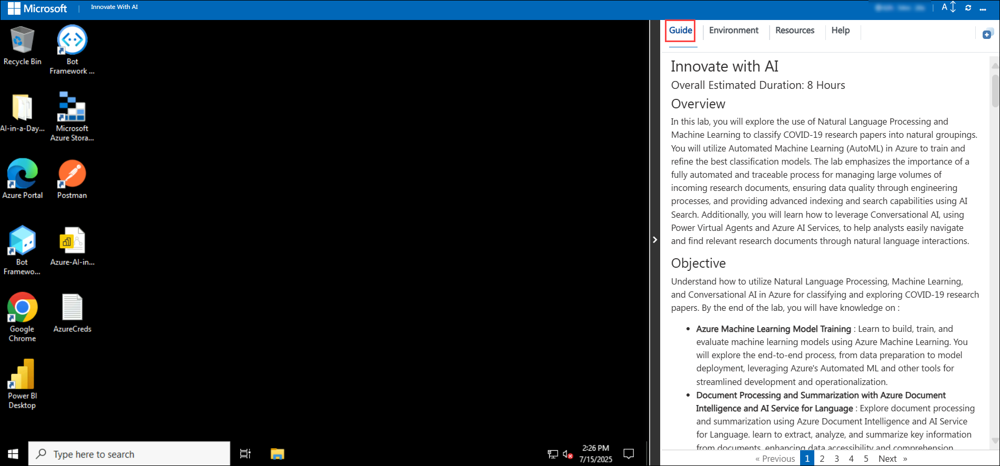
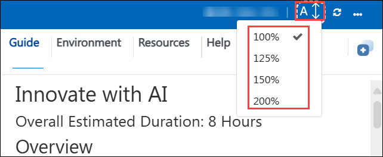
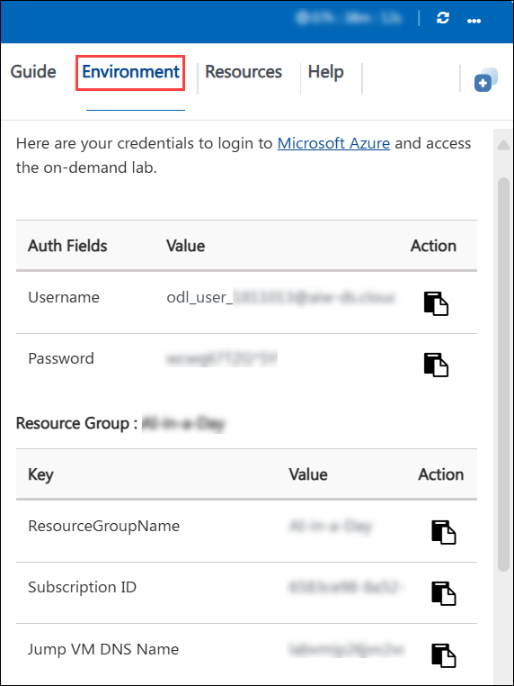
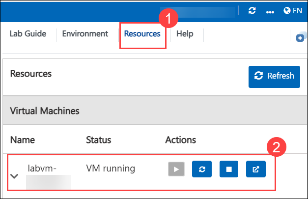
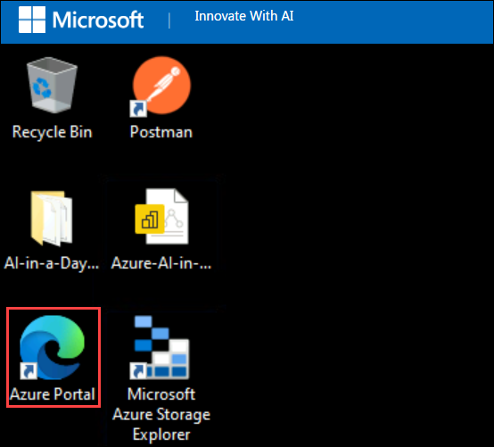
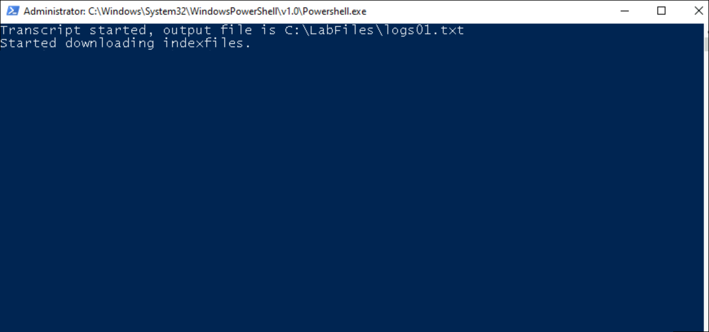
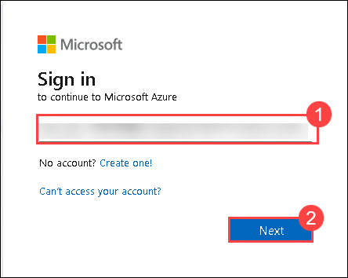
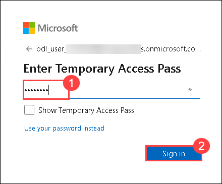

# Innovate with AI

### Overall Estimated Duration: 8 Hours

## Overview

In this lab, you will explore the use of Natural Language Processing and Machine Learning to classify COVID-19 research papers into natural groupings. You will utilize Automated Machine Learning (AutoML) in Azure to train and refine the best classification models. The lab emphasizes the importance of a fully automated and traceable process for managing large volumes of incoming research documents, ensuring data quality through engineering processes, and providing advanced indexing and search capabilities using AI Search. Additionally, you will learn how to leverage Conversational AI, using Microsoft Copilot Studio and Azure AI Services, to help analysts easily navigate and find relevant research documents through natural language interactions.

## Objective

Understand how to utilize Natural Language Processing, Machine Learning, and Conversational AI in Azure for classifying and exploring COVID-19 research papers. By the end of the lab, you will have knowledge on : 

- **Azure Machine Learning Model Training** : Learn to build, train, and evaluate machine learning models using Azure Machine Learning. You will explore the end-to-end process, from data preparation to model deployment, leveraging Azure's Automated ML and other tools for streamlined development and operationalization.
- **Document Processing and Summarization with Azure Document Intelligence and AI Service for Language** : Explore document processing and summarization using Azure Document Intelligence and AI Service for Language. learn to extract, analyze, and summarize key information from documents, enhancing data accessibility and comprehension.
- **Knowledge Mining with Azure AI Search** : Learn to create rich search experiences by indexing and exploring data, extracting insights, and enabling advanced search capabilities across structured and unstructured content.
- **Conversational AI with Microsoft Copilot Studio** : Learn to create and deploy sophisticated chatbots with no code, enabling automated interactions and enhanced customer engagement through intuitive, customizable conversational flows.

## Pre-requisites

Participants should have:

- Basic understanding of Azure AI Services.
- Experience with Microsoft Copilot Studio.
- Familarity with Machine Learning concepts.

## Architecture

In this lab, you will use AI technologies to manage and analyze COVID-19 research papers. You'll apply Natural Language Processing and Machine Learning with Azure Automated ML to classify and group papers effectively. The workflow involves transforming natural language data for machine learning, ensuring high data quality, and using Azure AI Search for advanced document indexing and exploration. Additionally, you'll also build a no-code Conversational AI using Microsoft Copilot Studio and Azure AI Services, enabling users to easily find relevant research through natural language interactions.

## Architecture Diagram

## Explanation of Components

The architecture for this lab involves the following key components:

- **Natural Language Processing (NLP)** : Utilizes NLP techniques to analyze and understand the text within research papers, enabling the extraction of meaningful information and patterns.

- **Machine Learning with Automated ML** : Employs Azure Automated ML to build, train, and refine classification models that automatically categorize and group research papers based on their content.

- **Azure AI Search** : Provides advanced indexing and search capabilities, allowing users to perform complex queries and explore semantic relationships within the research document corpus.

- **Data Engineering and Quality Assurance** : Involves transforming natural language data into numerical formats suitable for machine learning and ensuring data accuracy and completeness through robust quality checks.

- **Conversational AI with Microsoft Copilot Studio** : Builds an AI-powered chatbot interface with Microsoft Copilot Studio and integrated AI services to enable natural language interactions. This solution helps users easily search, navigate, and retrieve relevant research documents through a conversational experience.

## Getting Started with Lab
Once you're ready to dive in, your virtual machine and **Guide** will be right at your fingertips within your web browser.

## Lab Guide Zoom In/Zoom Out

To adjust the zoom level for the environment page, click the **A↕ : 100%** icon located next to the timer in the lab environment.

## Virtual Machine & Lab Guide
Your virtual machine is your workhorse throughout the workshop. The guide is your roadmap to success.

## Exploring Your Lab Resources
To get a better understanding of your lab resources and credentials, navigate to the **Environment** tab.

## Utilizing the Split Window Feature
For convenience, you can open the lab guide in a separate window by selecting the **Split Window** button from the top right corner.

## Managing Your Virtual Machine
Feel free to **Start, Restart, or Stop (2)** your virtual machine as needed from the **Resources (1)** tab. Your experience is in your hands!

## Let's Get Started with Azure Portal
 
1. On your virtual machine, click on the **Azure Portal** icon as shown below:
 
   

   >**Note:**  If a PowerShell window appears, wait for it to complete the process. It will close automatically once finished. If nothing happens after 3–5 minutes, press **Enter** to start the process manually. Once it begins, do not interfere, allow it to run until the window closes on its own.

   

1. On the **Sign in to Microsoft Azure** tab you will see the login screen, in that enter the following email/username, and click on **Next (2)**. 

   * **Email/Username**: <inject key="AzureAdUserEmail"></inject> **(1)**
   
      
     
1. Now enter the following password and click on **Sign in (2)**.
   
   * **Password**: <inject key="AzureAdUserPassword"></inject> **(1)**
   
      
     
1. If you see the pop-up **Stay Signed in?**, select **No**.

   

1. If you see the pop-up **You have free Azure Advisor recommendations!**, close the window to continue the lab.

1. If a **Welcome to Microsoft Azure** popup window appears, select **Cancel** to skip the tour.

## Support Contact

The CloudLabs support team is available 24/7, 365 days a year, via email and live chat to ensure seamless assistance at any time. We offer dedicated support channels tailored specifically for both learners and instructors, ensuring that all your needs are promptly and efficiently addressed.

Learner Support Contacts:

- Email Support: cloudlabs-support@spektrasystems.com
- Live Chat Support: https://cloudlabs.ai/labs-support

Click **Next >>** from the bottom right corner to embark on your Lab journey!

### Happy Learning!!

