# Lab 1: Azure Machine Learning Model Training

### Estimated Duration: 2 Hours

## Overview

Azure Machine Learning model training involves using Azure’s cloud-based platform to build, train, and tune machine learning models with scalable compute resources, automated workflows, and integrated tools, streamlining the process from data preparation to model deployment.

### Source datasets used by the labs

### COVID-19 Case Surveillance Public Use Data

https://data.cdc.gov/Case-Surveillance/COVID-19-Case-Surveillance-Public-Use-Data/vbim-akqf

The COVID-19 case surveillance system database includes individual-level data reported to U.S. states and autonomous reporting entities, including New York City and the District of Columbia (D.C.), as well as U.S. territories and states. On April 5, 2020, COVID-19 was added to the Nationally Notifiable Condition List and classified as “immediately notifiable, urgent (within 24 hours)” by a Council of State and Territorial Epidemiologists (CSTE) Interim Position Statement (Interim-20-ID-01). CSTE updated the position statement on August 5, 2020 to clarify the interpretation of antigen detection tests and serologic test results within the case classification. The statement also recommended that all states and territories enact laws to make COVID-19 reportable in their jurisdiction, and that jurisdictions conducting surveillance should submit case notifications to CDC. COVID-19 case surveillance data are collected by jurisdictions and shared voluntarily with CDC.

The dataset contains 13.4 million rows of deidentified patient data.

### COVID-19 Open Research Dataset

https://azure.microsoft.com/en-us/services/open-datasets/catalog/covid-19-open-research/

In response to the COVID-19 pandemic, the [Allen Institute for AI](https://allenai.org/) has partnered with leading research groups to prepare and distribute the COVID-19 Open Research Dataset (CORD-19), a free resource of over 47,000 scholarly articles, including over 36,000 with full text, about COVID-19 and the coronavirus family of viruses for use by the global research community. This dataset is made available by the the Allen Institute of AI and [Semantic Scholar](https://pages.semanticscholar.org/coronavirus-research).

This dataset is intended to mobilize researchers to apply recent advances in natural language processing to generate new insights in support of the fight against this infectious disease.

The corpus may be updated as new research is published in peer-reviewed publications and archival services like [bioRxiv](https://www.biorxiv.org/), [medRxiv](https://www.medrxiv.org/), and others.

## Lab Objectives

- Task 1: Explore dashboard of COVID-19 data
- Task 2: Explore lab scenario
- Task 3: Prepare Azure Machine Learning workspace
- Task 4: Prepare data for the Machine Learning process
- Task 5: Train a Machine Learning model with Automated ML
- Task 6: Explore AutoML results
- Task 7: Generate a Responsible AI dashboard
- Task 8: Explore the Responsible AI dashboard

## Task 1: Explore dashboard of COVID-19 data

In this task, you’ll open and explore the COVID-19 Power BI dashboard to review the source datasets that will be used in upcoming AI and ML exercises.

1. To explore the dashboard of COVID-19 data, open the `Azure-AI-in-a-Day-Data-Overview` file located on the desktop (**C:\Users\public\desktop**) of the virtual machine provided with your environment.

   

   > **Note:** Please close and reopen the Power BI Desktop document if it throws an error on the first attempt.

   >**Note:** If you see the **Introducing the updated mobile layout** pop-up screen, then close it by clicking on `Got it`.

   .png)

1. Collapse the **Fields (1)** and **Visualizations (2)** tabs to see the clear report.

   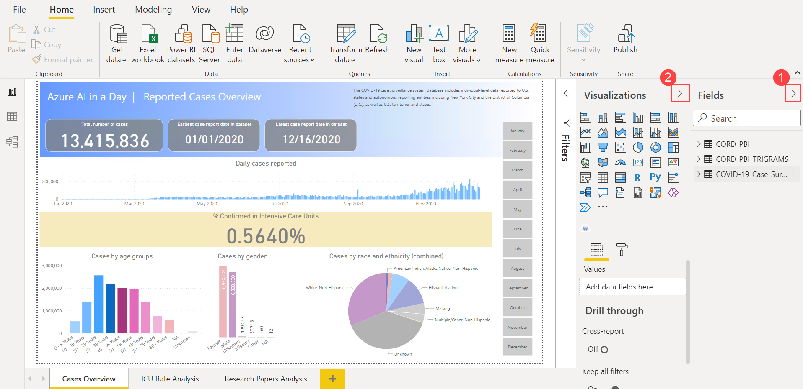

1. Understanding the source datasets is very important in AI and ML. To help you expedite the process, we have created a Power BI dashboard you can use to explore them at the beginning of each lab.

   

   >To get more details about the source datasets, check out the [Data Overview](https://github.com/CloudLabsAI-Azure/ai-in-a-day/blob/main/data-overview.md) section.

## Task 2: Explore lab scenario

Given the magnitude of the COVID-19 problem, it comes naturally to have a lot of research on the topic. In fact, in 2020 alone, tens of thousands of papers have been published on COVID-19 alone. The sheer amount of communication on the subject makes it difficult for a researcher to grasp and structure all the relevant topics and details. Furthermore, pre-defined catalogs and paper classification might not always reflect their content in the most effective way possible.

Based on a set of existing research papers, we will use Natural Language Processing and Machine Learning to identify these papers' natural grouping. For each new document that gets into our system, we will use Machine Learning to classify it into one of the previously identified groups. We will use Automated ML (a feature of Azure Machine Learning) to train the best classification model and explain its behaviour.

The following diagram highlights the portion of the general architecture covered by this lab.


The high-level steps covered in the lab are:

- Explore dashboard of COVID-19 data
- Explore lab scenario
- Run word embedding process on natural language content of research papers
- Explore results of word embedding
- Run clustering of research papers and explore results
- Use the newly found clusters to label the research document and run the Auto ML process to train a classifier
- Run the classifier on "new" research papers
- Explain the best model produced by AutoML

## Task 3: Prepare Azure Machine Learning workspace

In this task, you’ll access your Azure Machine Learning workspace, launch the studio, verify that your compute instance is running, and set up the required Python environment. You’ll then configure and launch Jupyter to prepare for running notebooks in the upcoming exercises.

1. In the **Azure portal** search bar, search for **All resources (1)** and select **All resources (2)** under Services.

    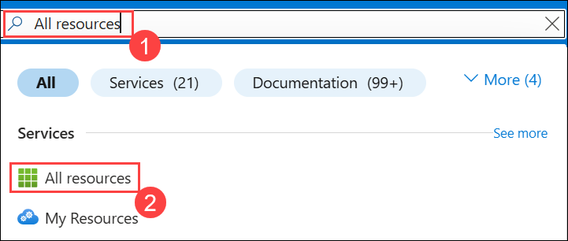
        
1. Locate **Azure Machine Learning workspace** resource named **<inject key="AML Workspace Name " enableCopy="true"/>** and select it.

    
    
1. On the **Overview (1)** page, click on **Launch studio (2)**. 
    
    
    
   >**Note:** If you are prompted to sign in again, use the same **lab credentials** you used to login to the Azure portal.  If a welcome pop-up appears, simply close it by clicking the **X (close)** icon.  

1. In **Azure Machine Learning Studio**, select **Compute (1)** from the left navigation menu and verify that your compute instance is **Running (2)**.
   
   * Compute instance name: **notebook<inject key="DeploymentID" enableCopy="false"/>**

     

     >**Note**: If you launched Azure Machine Learning Studio right after your lab environment was provisioned, you might find the compute instance in a provisioning state. In this case, wait a few minutes until it changes its status to `Running`.

1. In the **Azure Machine Learning Studio** under **Compute** **(1)**, click on **ellipsis (...) (2)** and, open the **Terminal** **(3)** environment.
    
   
   
1. Run the following commands and make sure all commands will execute successfully.
    
    ```  
    conda env create -f aiw-ai-kernel.yml
    ```
     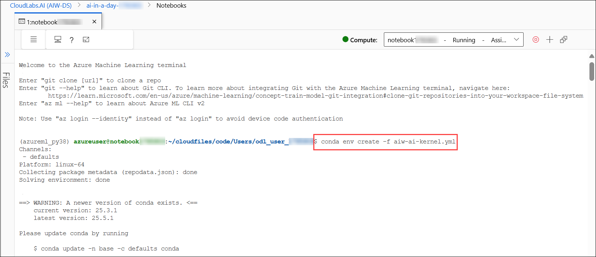

1. Accept the **Terms of Service (ToS)**, by typing **a** and then press **Enter**.

   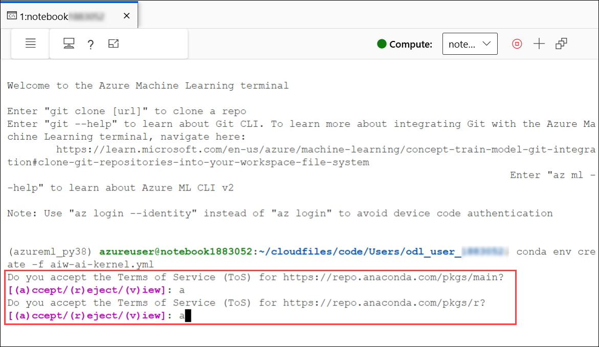

1. Please wait until the command completes successfully. It may take around 5 minutes.   

1. Now run the following the commands: 

    ```
    conda activate aiw-ai-kernel
    ```
    
    ```
    ipython kernel install --user --name aiw-ai-kernel --display-name "Python (aiw-ai-kernel)"
    ```
   
   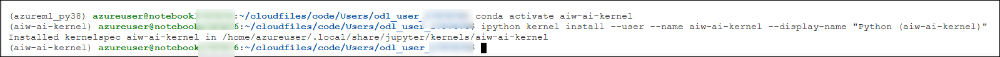

    > **Note:** Ensure that you execute all the commands and verify that they run to completion.

1. Navigate back to **Compute (1)**, under the **Applications** **(2)** section associated with the compute instance, select **Jupyter** **(3)**. 

    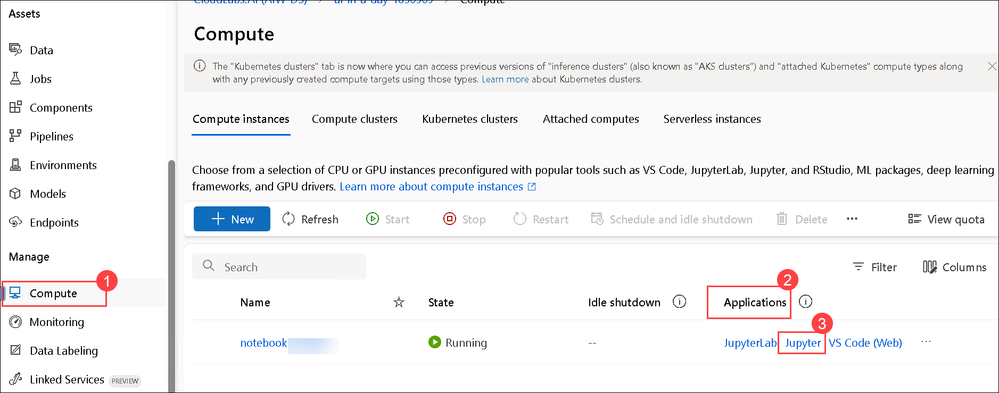

1. If you see **IMPORTANT NOTE: Always use trusted code**, then check **Yes, I Understand (1)** and then click on **Continue (2)**.

    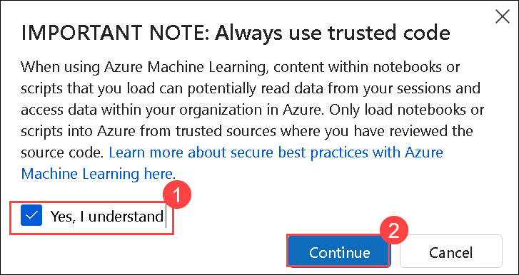
    
   >**Note**: If prompted with Do you wish to trust this compute instance? webpage, click on **Click here to trust this compute instance**.
    
    
    
## Task 4: Prepare data for the Machine Learning process

In this task, you’ll prepare and register the datasets required for the machine learning process. You will execute the provided Jupyter notebook to preprocess the COVID-19 articles data, configure the correct kernel, update storage details, and run all necessary cells. After preprocessing, you’ll create and register the **COVID19Articles\_Train\_Vectors** and **COVID19Articles\_Test\_Vectors** datasets in Azure Machine Learning Studio, making them available for use in subsequent model training and evaluation steps.

1. In the Jupyter application, navigate to the given path **\Users\odl_user_<inject key="DeploymentID" enableCopy="false"/> (1)** and open `1. Data Preparation.ipynb` **(2)** notebook.

   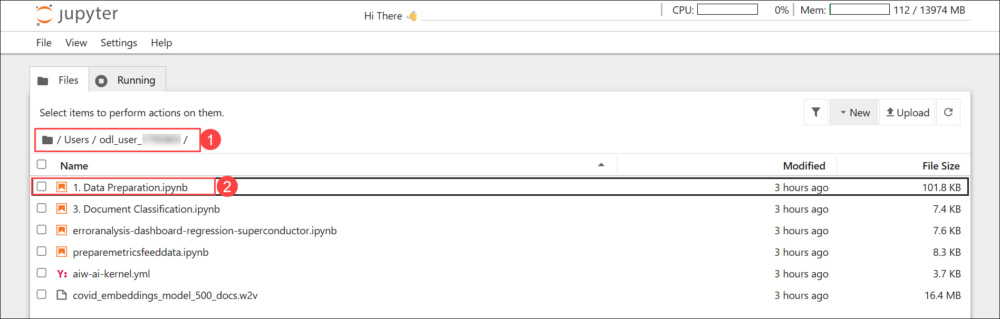
   
1. On the Jupyter page, go to the top menu and click **Kernel (1)**, then choose **Change Kernel... (2)**. In the dialog box, select **Python (aiw-ai-kernel) (3)** from the dropdown and click **Select (4)** to confirm.

   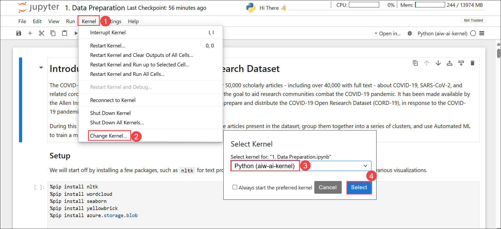

1. Execute the cells inside `1. Data Preparation.ipynb`. notebook and observe the results of each cell execution.

   - **Run this cell and advance (Shift + Enter) (1)**
   - **Restart the kernel (2)**
   - **Restart the kernel and run all cells (3)**

     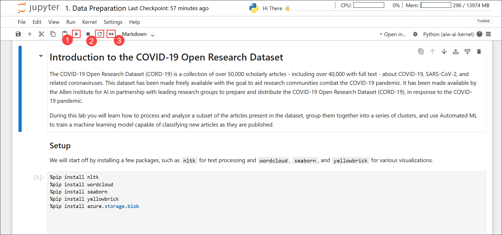

      

 1. Once the packages have been updated **(1)**, please **restart (2)** the kernel. 

     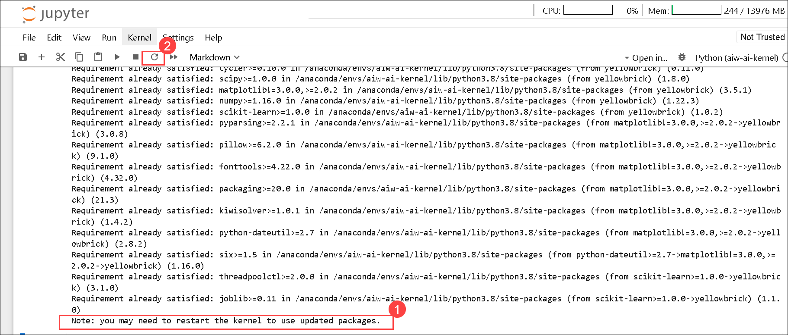

 1. In the **Restart Kernel?** pop-up, click on **Restart**.

      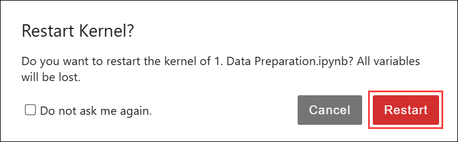    

 1. Run the import cell and ensure it completes execution.

    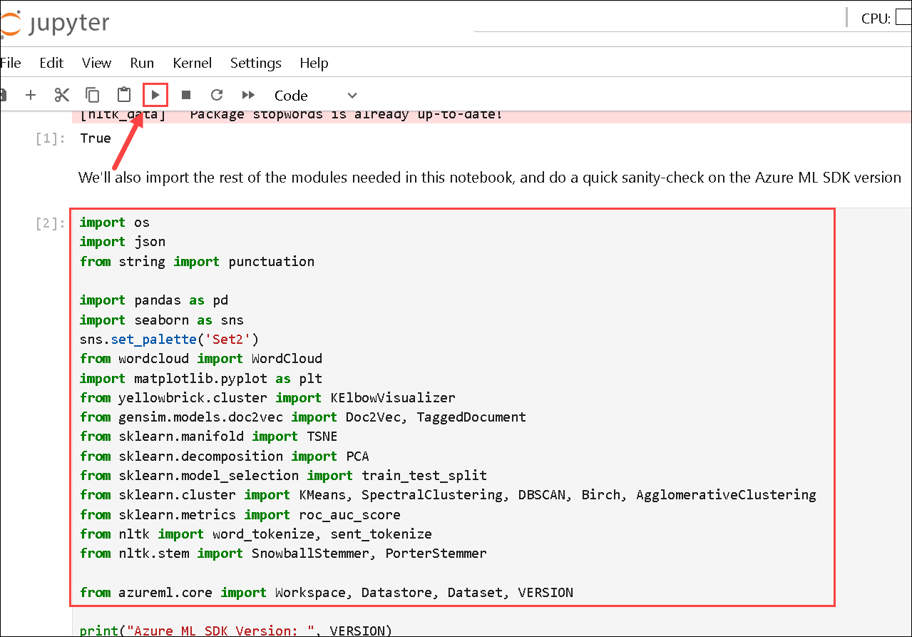

    >**Note:** If you see the "IProgress not found" error, it is expected. Please proceed further.

1. Run each of the cells in the notebook and please make sure to read the cells carefully and update the storage account name wherever required with **<inject key="Storage Account Name" enableCopy="false"/>** and storage account access key with **<inject key="Storage Account Access key" enableCopy="false"/>**.

      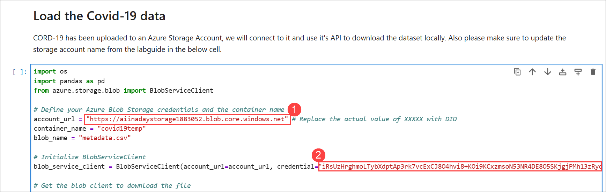

      .png)

1. In the same way, make sure to run all the cells before proceeding to the next step.

1. Once all the cells have been executed, navigate back to the studio, and in the left navigation pane, select **Data (1)** and click on **+ Create (2)**.

   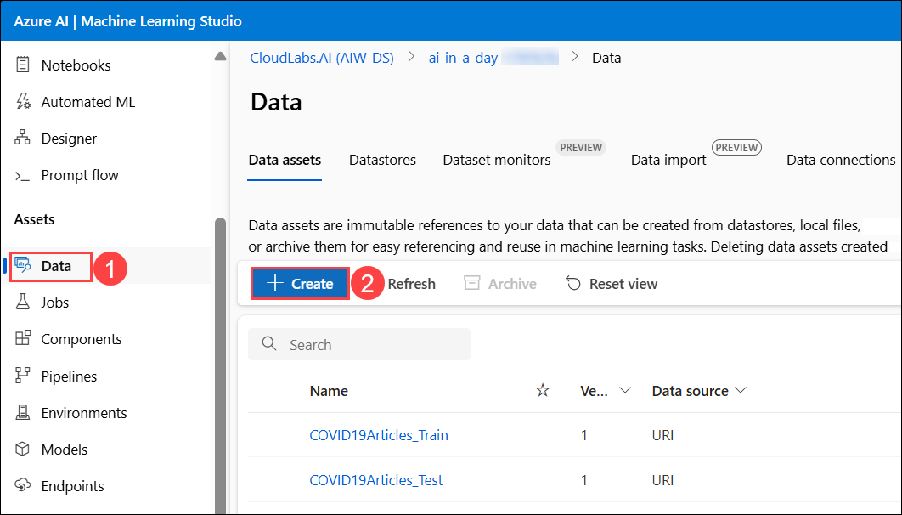

1. On the **Create data asset** page, provide the name as **COVID19Articles_Train_Vectors (1)**, select the type as **Tabular (2)** and click on **Next (3)**.

   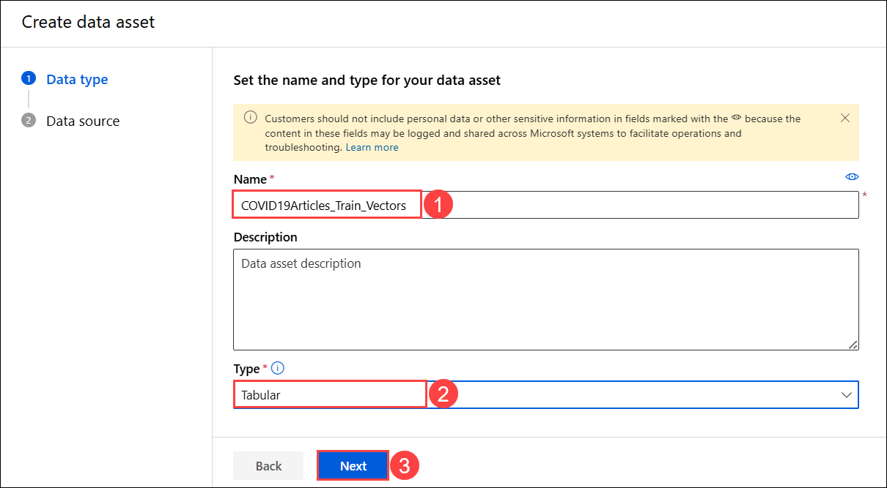

1. In **Data source** section, select **From Azure storage (1)** and click on **Next (2)**.

   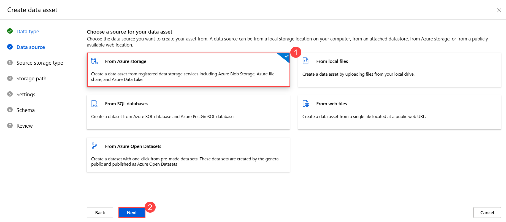

1. In **Source storage type** section, select **Azure Blob Storage (1)** for Datastore type. Then choose **workspaceblobstore (2)** and click on **Next (3)** to proceed.

   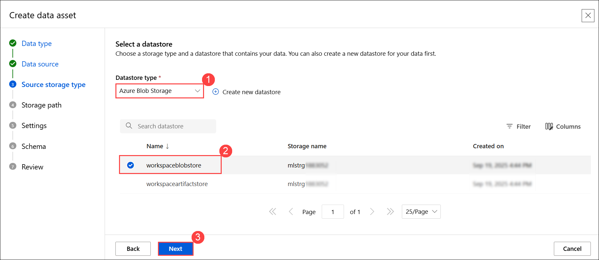

1. In **Storage path** section, select the **covid19articles_data (1)** folder and click to open it.

   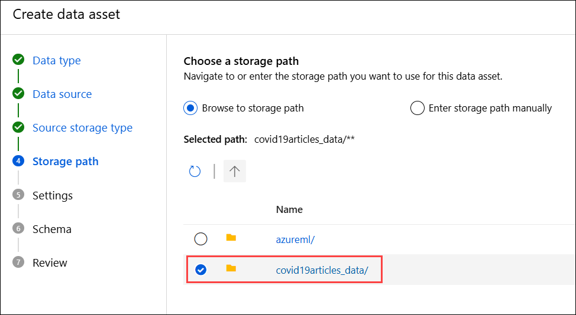

1. Select the **train_data_vectors.csv (1)** file and now click on **Next (2)** thrice.

   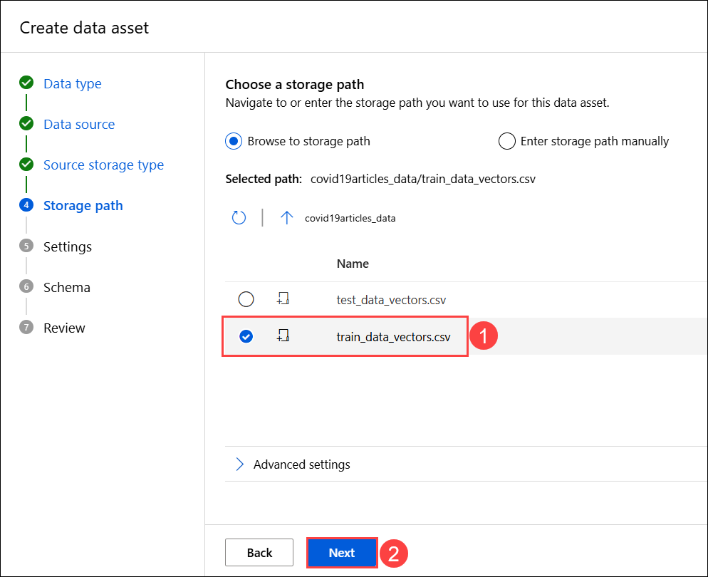

1. Review the setting for your data asset, then click on **Create.**

   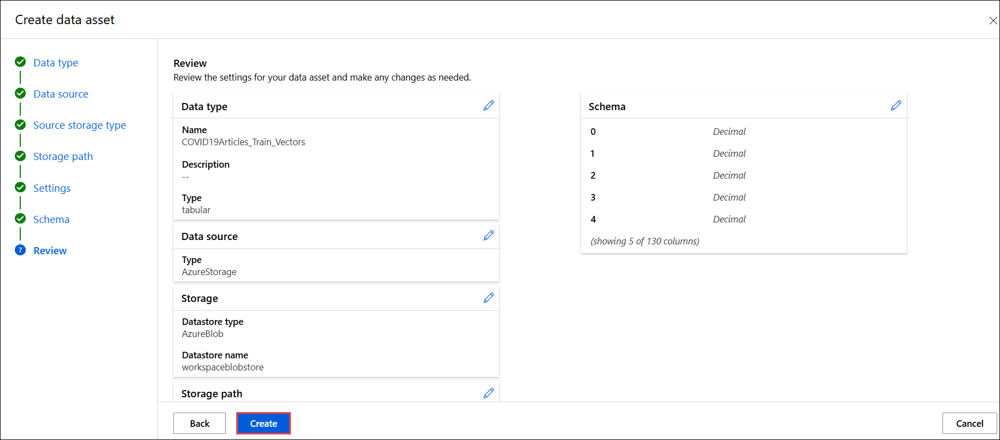

1. You will now see the details of the newly created **COVID19Articles_Train_Vectors** dataset displayed on the screen.

   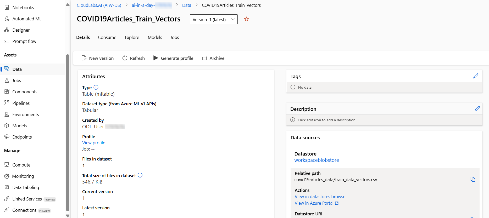

1. Navigate back to the studio, click on **Data (1)** in the left-hand menu, and then select **+ Create (2)** to start creating a new dataset.

   

1. On the Create data asset page, provide the name as **COVID19Articles_Test_Vectors (1)**, select the type as **Tabular (2)** and click on **Next (3)**.
   
   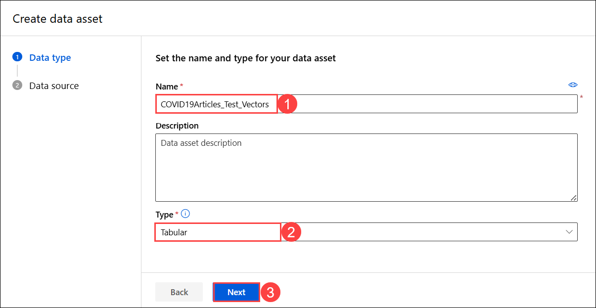

1. In **Data source** section, select **From Azure storage (1)** and click on **Next (2)**.

   

1. In **Source storage type** section, select **Azure Blob Storage (1)** for Datastore type, click on **workspaceblobstore (2)** and click on **Next (3)**.

   

1. In **Storage path** section, select the **covid19articles_data (1)** folder.

   

1. Select the **test_data_vectors.csv (1)** file and click on **Next (2)** thrice.  

   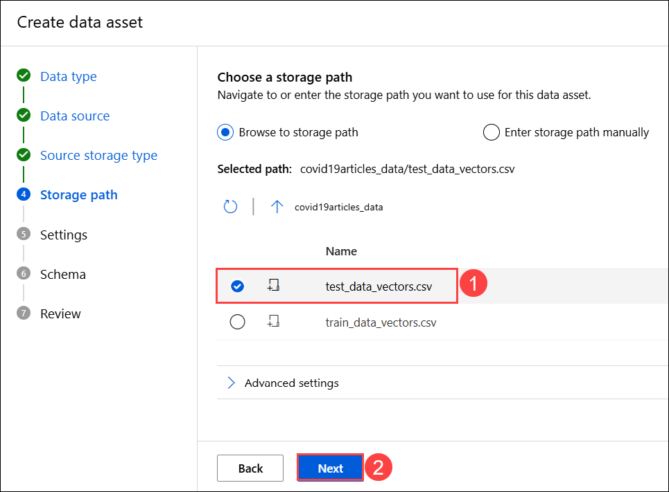

1. Review the setting for your data asset, then click on **Create.**

   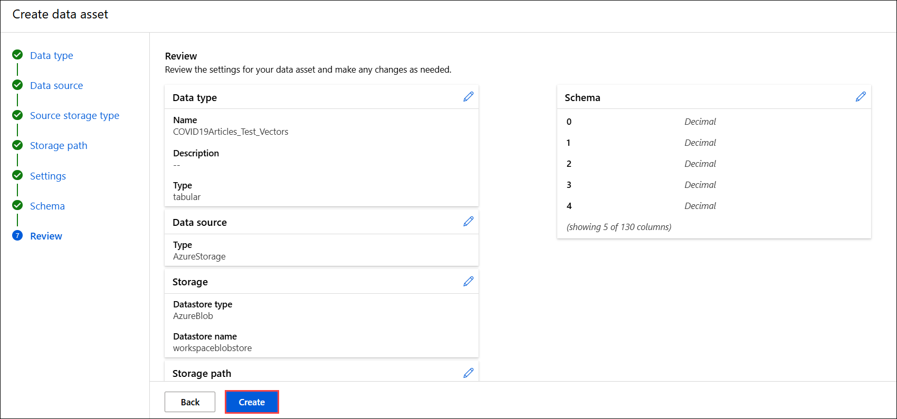

1. You will now see the details of the newly created **COVID19Articles_Test_Vectors** dataset displayed on the screen.

   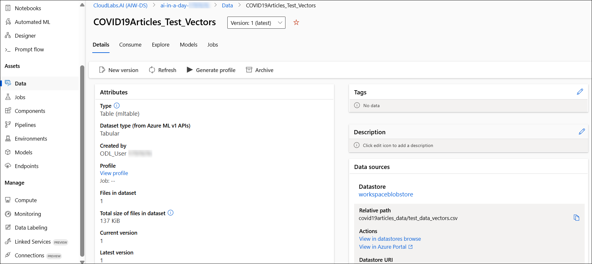

## Task 5: Train a Machine Learning model with Automated ML

In this task, we'll use Azure Automated ML to train a machine learning model capable of determining the best cluster for a COVID-19 scientific article. It builds upon the work done in the Data Preparation notebook.

1. In the Azure Machine Learning Studio, from the left navigation pane, select **Automated ML** **(1)** section and click **+ New Automated ML job** **(2)** to start the Automated ML.

    

2. On the **Submit an Automated ML job** page, provide the following details in **Basic settings** section:

   - Experiment name: **Select existing** **(1)** 
   - Existing experiment: Select **COVID19_Classification** **(2)**
   - Click  on **Next** **(3)** to proceed.

     
   
     >**Note:** If the Select **Experiment Name** section is greyed out, create a new experiment. Change the default experiment name to **COVID19_Classification**, then click **Next** to continue.

3. On the **Task type and data** section,

   - **Select task type**:  Make sure **Classification** **(1)** is selected from the dropdown.
   - Select **COVID19Articles_Train_Vectors** **(2)** as your **dataset**
   - Click **Next** **(3)** to proceed.

     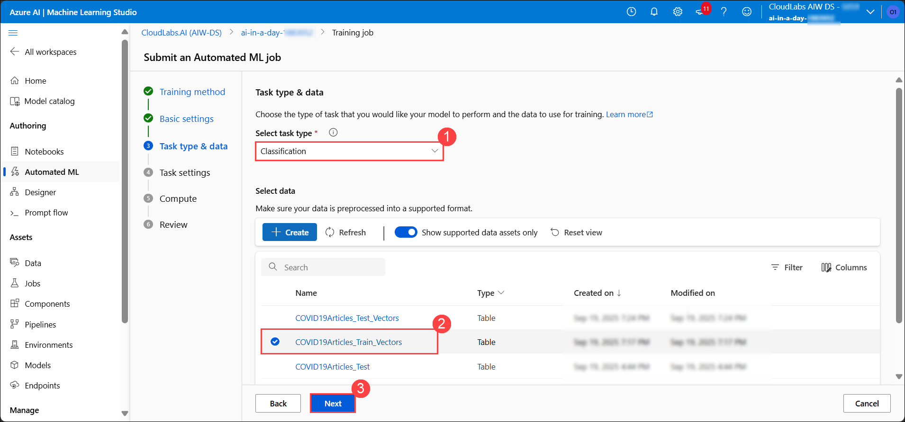

4. On **Task settings** section, select the Target column to **cluster (Integer)** **(1)**. The values we're trying to predict are in the **cluster** column. Scroll down on the same page, fill in the values listed below and click **Next** **(4)**.

    - Validation type : **k-fold cross validation (2)**
    - Number of cross validations: **5 (3)**

      png.png)
      
5. In order to be able to launch an Automated ML run, we need to provision an Azure ML compute cluster. On the **Compute** page, 

   - Select compute type as **Compute Cluster** **(1)** 
   - Select Azure AML compute cluster as **aml-compute-cpu** **(2)** from the list of clusters
   - Then click on **Next** and proceed with **step 8** 
   
     >**Note**: If the list is empty only then select **+ New** **(3)** link and follow the steps 6 and 7.

      png.png)

       >**Note**: If you already have `aml-compute-cpu` cluster provisioned, feel free to skip to step 8.

6. On the `Create compute cluster` screen set the values listed below:

    - Virtual machine priority: **Dedicated (1)**
    - Virtual machine type: **CPU (2)**
    - Virtual machine Size: **Standard_DS3_v2 (3)**
    - Select `Next` **(4)** to continue.

      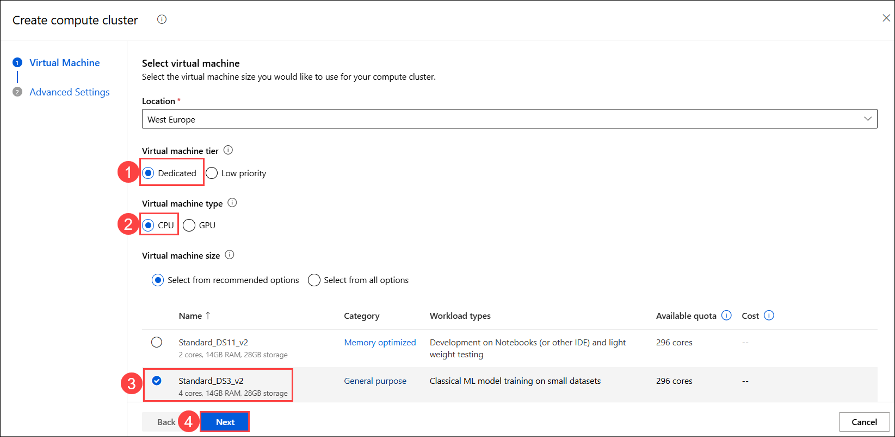  

7. To configure cluster settings set the values given below:

    - Compute name: **aml-<inject key="DeploymentID" enableCopy="false"/> (1)**
    - Minimum number of nodes: **0 (2)**
    - Maximum number of nodes: **4 (3)**
    - Click on **Create (4)** to proceed.

      >**Note:** Setting the number of maximum nodes to a higher value will allow Automated ML to run more experiments in parallel but will also increase your costs.

      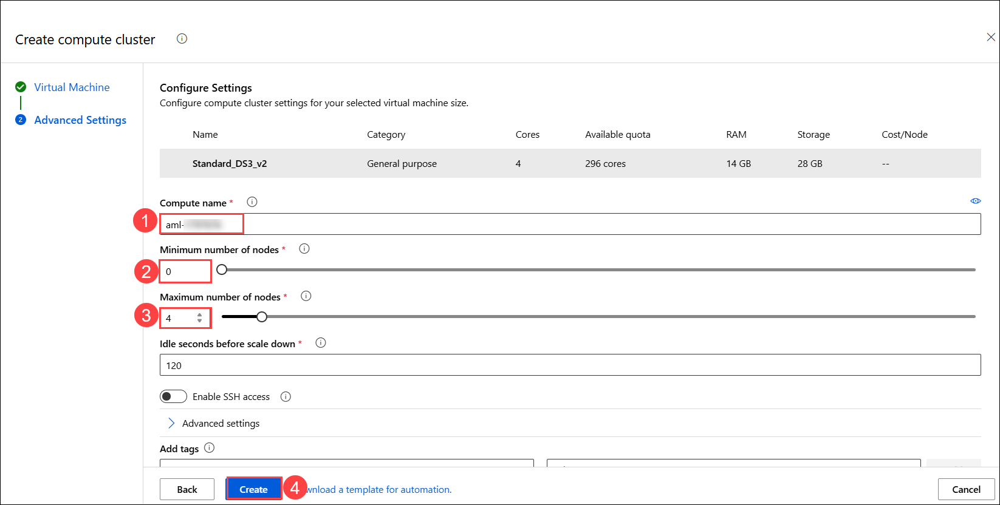    

10. On the Review page, select **Submit training job**  to kick off the Automated ML experiment run. If this is the first time you are launching an experiment run in the Azure Machine Learning workspace, the total experiment time will be longer than the `training job time` we have set. This is because of the time needed to start the Compute Cluster and deploy the container images required to execute.

    

12. On the following screen, you will see the progress of your experiment run.

    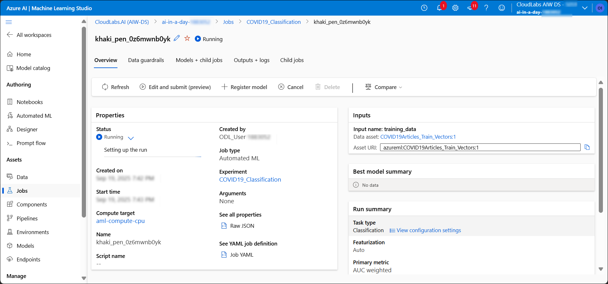

13. Now that you understand the process of launching an AutoML run, let's explore in the next task the results of an already completed AutoML run.

    >**Note**: We have already executed in this environment an AutoML run that is very similar to the one you've just launched. This allows you to explore AutoML results without having to wait for the completion of the run.

## Task 6: Explore AutoML results

In this task, you’ll review the results of the AutoML experiment by exploring the completed run of the **COVID19\_Classification** experiment in Azure Machine Learning Studio. You will analyze key metrics such as **AUC weighted**, examine model performance across child jobs, and explore the available tabs to gain deeper insights into the trained models.

1. In the Azure Machine Learning Studio, navigate to the **Jobs (1)** section and locate the **COVID19_Classification** **(2)** experiment, then click on experiment name to open it.

   

2. You will navigate to the experiment details page, where you should see the list of experiment runs. Locate the first run **(1)** listed here, which has the status **Completed**. 

   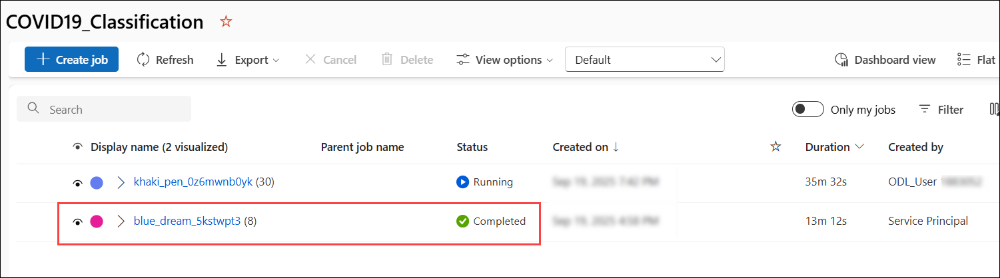

   >**Note:** The name of the run can be different in your environment and may not match the below screenshot.

3. On the **Run details** page, navigate to the **Models+ child jobs** section. Check the values on the  **AUC weighted** column, which is the primary metric selected in the AutoML run configuration. 

   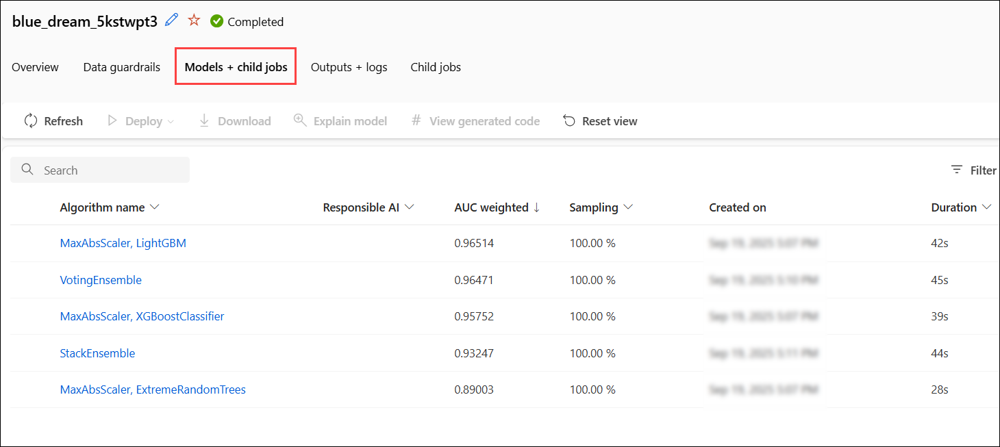

4. Browse all the tabs to get more details about the model.

   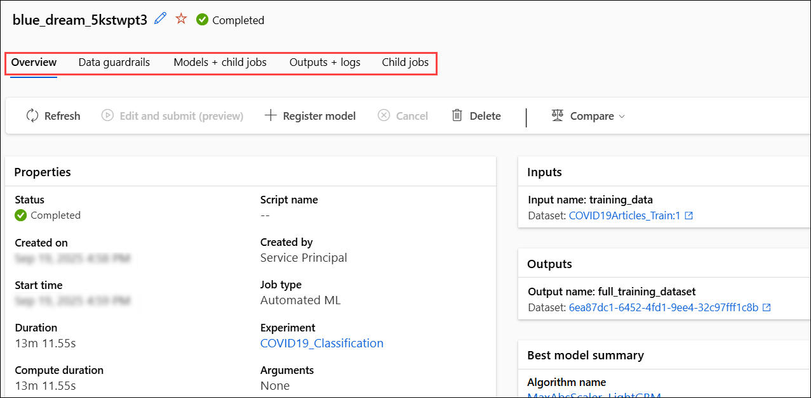

> **Congratulations** on completing the task! Now, it's time to validate it. Here are the steps:
> - Hit the Validate button for the corresponding task. You can proceed to the next task if you receive a success message.
> - If not, carefully read the error message and retry the step, following the instructions in the lab guide.
> - If you need any assistance, please contact us at cloudlabs-support@spektrasystems.com. We are available 24/7 to help you out.

<validation step="46d5c33f-126f-4f3c-9a15-a4596a0b876c" />

## Task 7: Generate a Responsible AI dashboard

Responsible AI is a governance framework that documents how a specific organization is addressing the challenges around artificial intelligence (AI) from both an ethical and legal point of view. Resolving ambiguity about where responsibility lies if something goes wrong is an important driver for responsible AI initiatives.

**Principles of responsible AI**: AI and the machine learning models that support it should be comprehensive, explainable, ethical and efficient.

 - Comprehensive AI has clearly defined testing and governance criteria to prevent machine learning from being hacked easily.
 - Explainable AI is programmed to describe its purpose, rationale and decision-making process in a way that can be understood by the average end user.
 - Ethical AI initiatives have processes in place to seek out and eliminate bias in machine learning models.
 - Efficient AI is able to run continually and respond quickly to changes in the operational environment.

In this task, you’ll generate and review a Responsible AI dashboard by running the `erroranalysis-dashboard-regression-superconductor.ipynb` notebook. After configuring the kernel and executing all cells, you’ll open the provided endpoint to explore model explanations, error patterns, and fairness insights for responsible AI evaluation.

1. In the Jupyter application, navigate to the given path **\Users\odl_user_<inject key="DeploymentID" enableCopy="false"/> (1)** and open `erroranalysis-dashboard-regression-superconductor.ipynb` **(2)** notebook.

   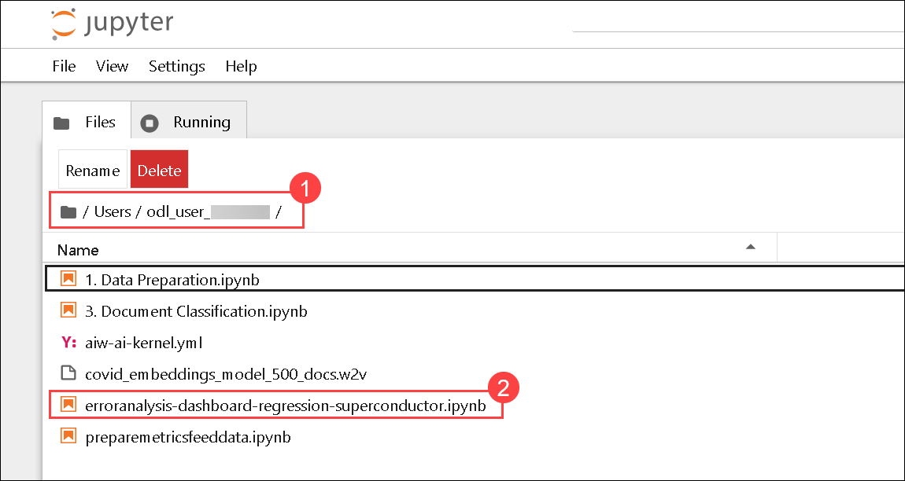
   
1. On the Jupyter page, go to the top menu and click **Kernel (1)**, then choose **Change Kernel... (2)**. In the dialog box, select **Python (aiw-ai-kernel) (3)** from the dropdown and click **Select (4)** to confirm.

   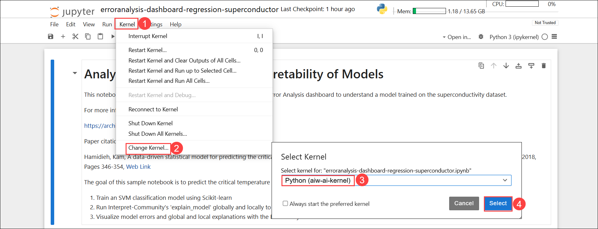

1. Execute the cells inside `erroranalysis-dashboard-regression-superconductor.ipynb` notebook one by one (Click on the **Run** button or by using either **Ctrl + Enter** to stay on the same cell, or **Shift + Enter** to advance to the next cell or) and observe the results of each cell execution.

   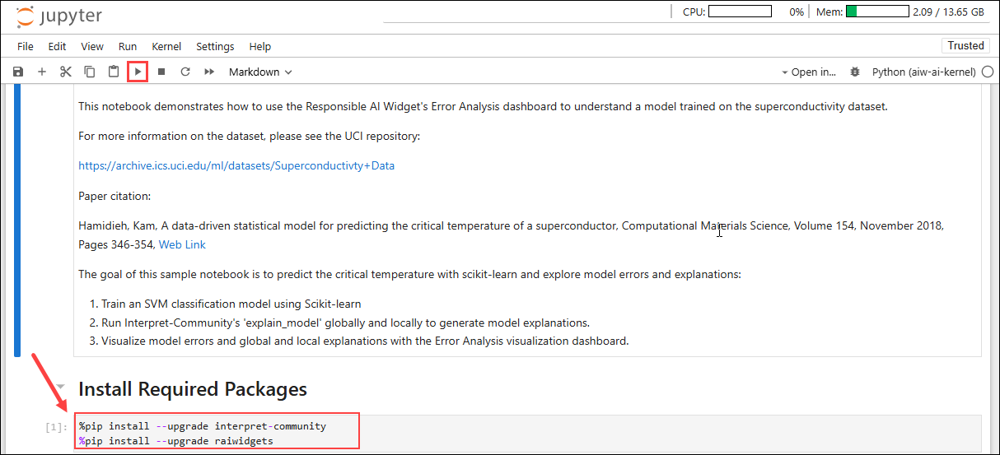

1. Please restart the kernal once the packages have been updated by clicking on the **Restart the kernel (1)** icon on the top.

   .png)

1. In the **Restart Kernel?** pop-up window, click on **Restart**.

   .png)

1. Run the import cell and ensure it completes execution.

    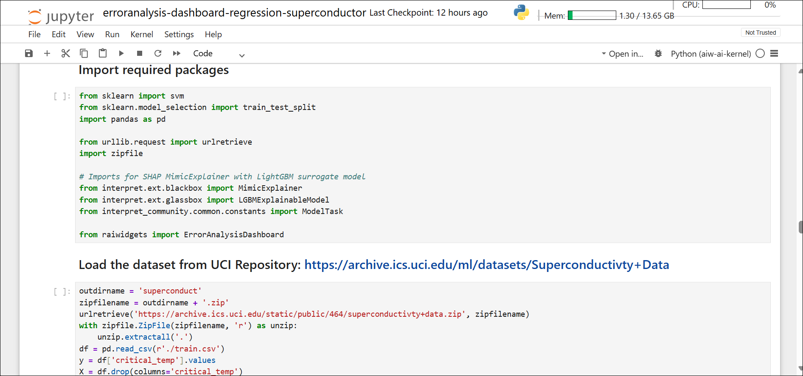

     >**Note:** If you see the "IProgress not found" error, it is expected. Please proceed further.    

1. Please make sure to read the cells carefully and run them one by one. Click on the **Endpoint** URL at the end of the notebook before moving to the next task.

   

## Task 8:  Explore the Responsible AI dashboard

In this task, you’ll explore the Responsible AI dashboard by interacting with the **Error Explorer** and **Explanation** views. You will analyze model performance using tree maps, heat maps, and box plots with different metrics and features to better understand errors, patterns, and explanations in the model’s predictions.

1. Once you click on the endpoint, you will be navigated to the new tab. Select **Tree map (1)** from the drop-down next to **Error Explorer**,  choose the **Mean squared error (2)** for **Select metric** and click on **Explanation (3)** to view the results. 

   
 
1. On the **Explanation** page, observe the box plot graph representing the data. In addition, you can explore the available options to view different representations of data.

   

1. Navigate back to **Error explorer** page,

   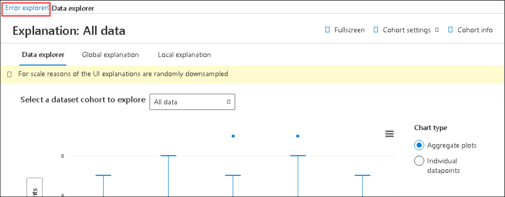

1. On the **Error explorer** page, choose **Heat map (1)** form the drop-down next to **Error Explorer**. 
   
   - For **Rows: Feature 1 :** Select **number_of_elements (2)**  
   - For **Columns: Feature 2 :** Select **mean_atomic_mass (3)** 
   - Set **Select mertic:** **Mean absolute error (4)** .

     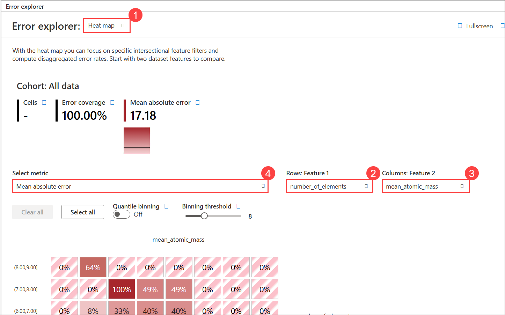

     >**Note:** If you don’t see options like **number\_of\_elements** or **mean\_atomic\_mass** in the drop-down, scroll down and select them from the list.

     .png)

## Summary

In this lab, you explore the COVID-19 data dashboard, set up and prepare your Azure Machine Learning workspace, train and evaluate a model using Automated ML, and generate and analyze a Responsible AI dashboard.

### You have successfully completed the Lab 1. Click on Next >> to proceed with the next Lab.


