# Lab 2: Document Processing and Summarization with Azure Document Intelligence and AI Service for Language

### Estimated Duration: 2 Hours 30 Minutes

## Overview

Azure Document Intelligence and AI Service for Language streamline document processing by extracting key information and automating summaries, leveraging AI to enhance data extraction accuracy and deliver actionable insights efficiently.

## Lab Objectives

- Task 1: Explore the dashboard of COVID-19 data
- Task 2: Explore lab scenario
- Task 3: Creating Azure Search Indexes
- Task 4: Querying Azure Search Indexes
- Task 5: Updating Azure Search Indexes
- Task 6: Using the Document Intelligence Studio
- Task 7: Document Summarization via AI Service for Language Integration

## Task 1: Explore the dashboard of COVID-19 data

In this lab, you’ll open and explore the COVID-19 Power BI dashboard to review the source datasets that will be used in upcoming AI and ML exercises.

1. To explore the dashboard of COVID-19 data, open the `Azure-AI-in-a-Day-Data-Overview` file located on the desktop (**C:\Users\public\desktop**) of the virtual machine provided with your environment.

   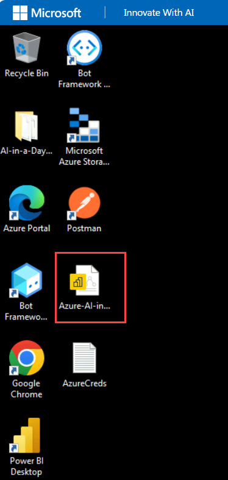

   > **Note:** Please close and reopen the Power BI Desktop document if it throws an error on the first attempt.

   >**Note:** If you see the **Introducing the updated mobile layout** pop-up screen, then close it by clicking on `Got it`.

   .png)

1. Collapse the **Fields (1)** and **Visualizations (2)** tabs to see the clear report.

   

1. Understanding the source datasets is very important in AI and ML. To help you expedite the process, we have created a Power BI dashboard you can use to explore them at the beginning of each lab.

   

   >To get more details about the source datasets, check out the [Data Overview](https://github.com/CloudLabsAI-Azure/ai-in-a-day/blob/main/data-overview.md) section.

## Task 2: Explore lab scenario

Another critical problem to deal with when it comes to the volumes of research documents covering COVID-19 is the problem of advanced indexing and searching their content. The specific internal structure of research papers (including citations, contributors, and various entities like diagnosis, forms of examination, family relations, genes, medication, symptoms or signs, and treatments) form a reach semantic graph that goes way beyond simple document categorization. An analyst would benefit significantly from exploring the corpus of documents in a way that considers all these complex relationships.

Using the AI Search capabilities, we will create a complex index of documents that allows an analyst to perform an advanced search and explore the inter-document graph relationships.

The following diagram highlights the portion of the general architecture covered by this lab.


The high-level steps covered in the lab are:

- Explore dashboard of COVID-19 data
- Explore lab scenario
- Explore the document search process
- Explore the graph search process
- Add a set of new documents and trigger the index update process
- Explore the document and graph search and identify updated results

## Task 3: Creating Azure Search Indexes

In this task, you’ll set up Azure Cognitive Search indexes by configuring data source schema files with your storage account connection string, and then using a PowerShell script to create the data sources, indexes, and indexers. This will prepare the search service to query and retrieve information from the COVID-19 datasets.

1. Navigate to the [Azure portal](https://portal.azure.com), search for **Resource groups (1)** and select **Resource groups (2)** under Services.

    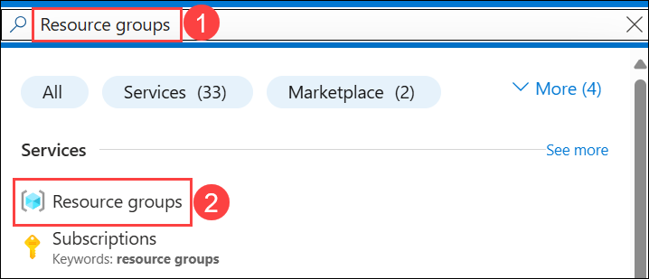

1. Select the **AI-in-a-Day** resource group.

    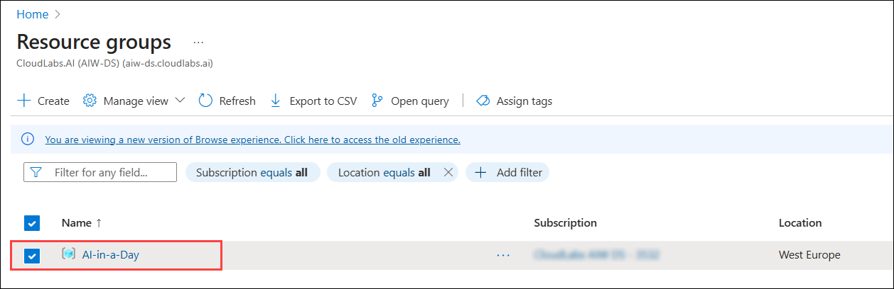

1. Locate **Search service** resource **aiinaday-cog-<inject key="DeploymentID" enableCopy="false"/>** and select it.

    

1. Copy the search service **URL** and save it in a notepad. Also note the **service account name**, which is the part before `.search.windows.net` in the URL.

    

1. Go to **Keys (1)** under **Settings**, copy the **Primary admin key (2)**, and save it in the notepad.

    

1. On the Azure portal, search for **Storage accounts (1)** and then select **Storage accounts (2)** from the Services.

    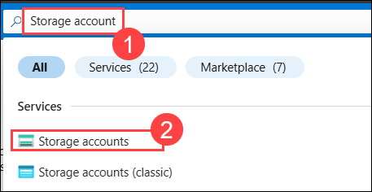

1. Navigate to Storage account named **aiinadaystorage<inject key="DeploymentID" enableCopy="false"/>**.

    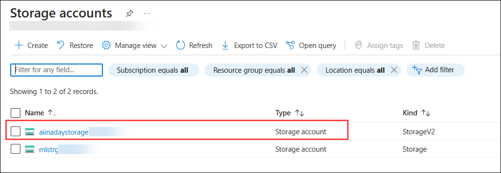

1. On the Storage account named **aiinadaystorage<inject key="DeploymentID" enableCopy="false"/>** **(1)**, under **Security + networking** from left navigation pane ,select **Access keys** **(2)** . Click on **Show (3)** of the connection string under Key1  to see the connection string and **copy the connection string** **(4)** under Key1. Paste this into notepad.

   

1. Go to the LabVM and open **File Explorer** from the task bar and navigate to the path `C:\Temp\AzureSearch\` **(1)**. There are six files, three prefixed with `abstracts` **(2)** and three with `covid19temp` **(3)**.

   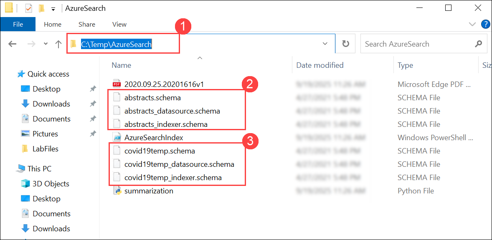

1. Double click on the `abstracts_datasource.schema` **(1)** file and in the **Windows cant't open this type of file (.schema)** window, click **Try an app on this PC (2)**, then in **How do you want to open this file?** window, select **Notepad (3)**, and then click on **OK (4)**.

   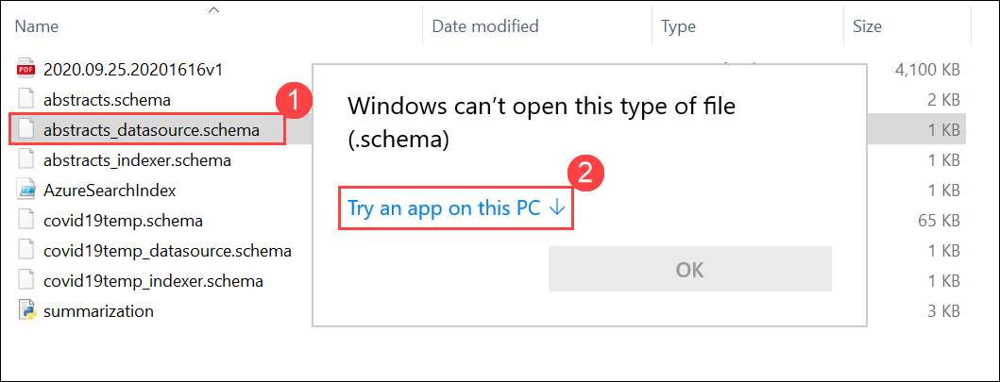

   .png)

1. Replace the segment starting `<< TODO:>>` with your Storage account connection string **<inject key="storageAccountConnectionString" enableCopy="true"/>** and then save the file.

    

    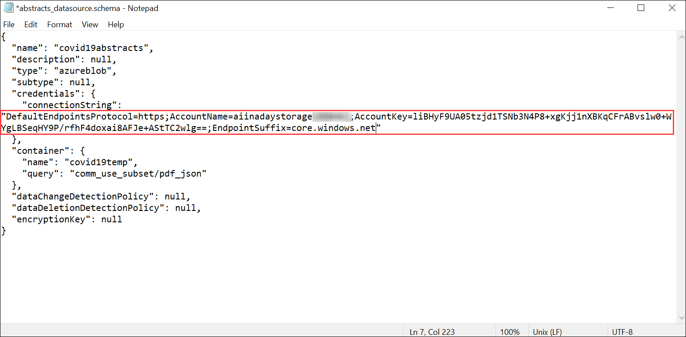

1. Similarly, open the `covid19temp_datasource.schema` file with a text editor and replace the segment starting `<< TODO:>>` with your Storage account connection string **<inject key="storageAccountConnectionString" enableCopy="true"/>** and then save the file.

    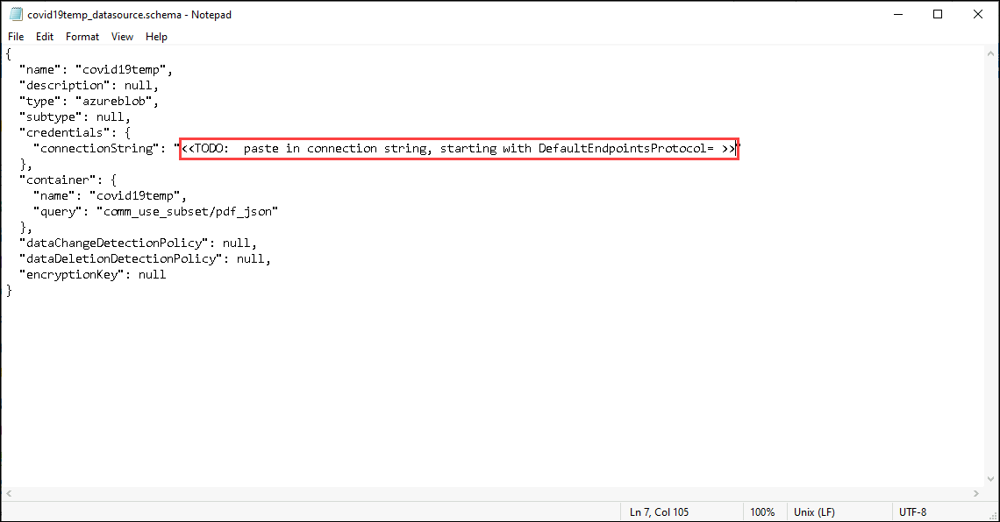

    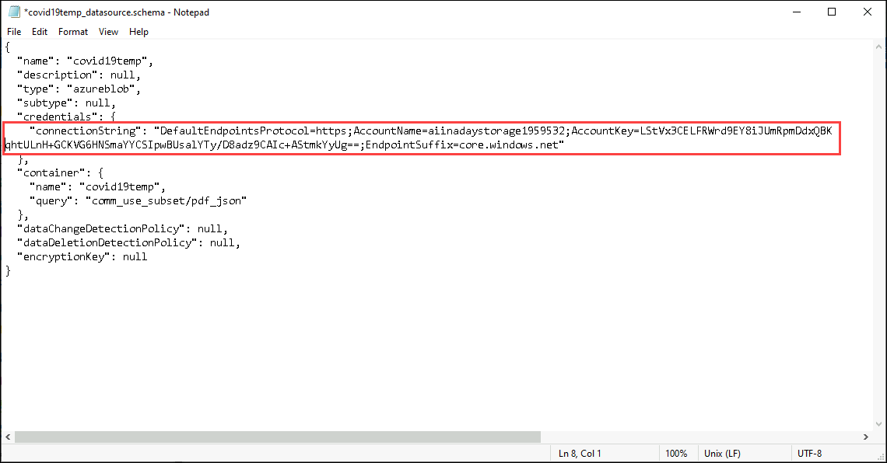

1. Now, locate the **AzureSearchIndex.ps1** **(1)** file at  path`C:\Temp\AzureSearch\` and right- click on it and select **Open with... (2)** from the context menu.

     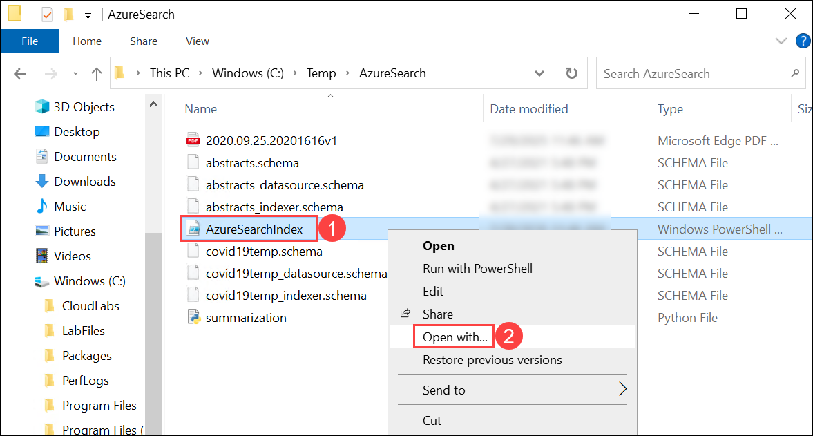

1. From **How do you want to open this file?** prompt, select **Notepad (1)** and click **OK (2)** to open the script. Once opened, copy the entire content of the file.

     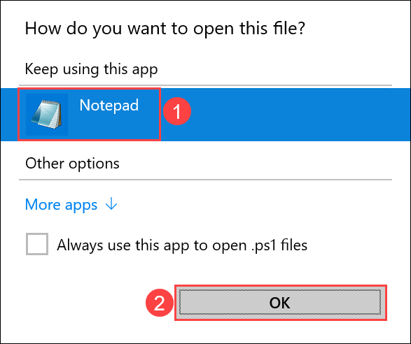

     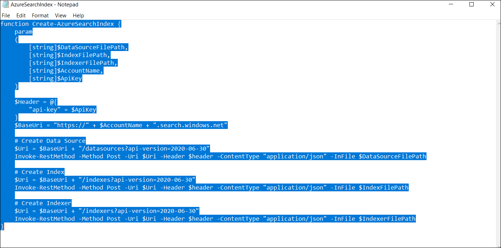

1. On your VM's search bar, type **Windows Powershell (1)**, then right click on **Windows Powershell (2)** and select **Run as administrator (3)**.

     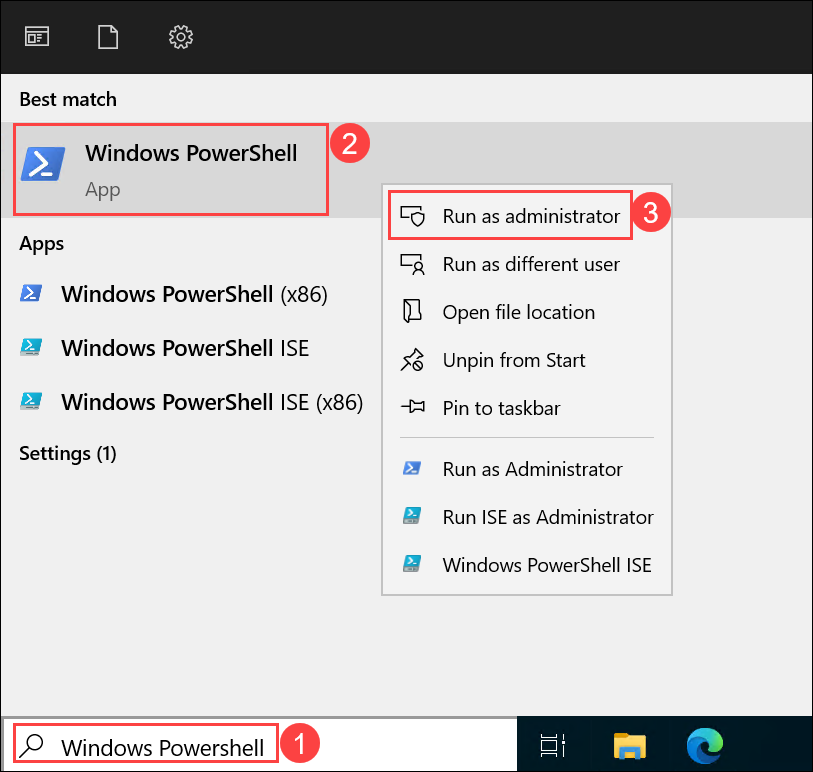

1. In the Powershell, run the below given command to navigate to the following directory:

    ```
    cd C:\Temp\AzureSearch\
    ```

    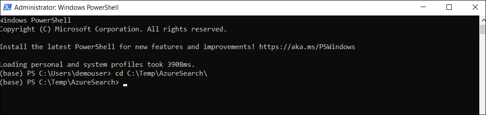

1. Paste the copied code from the **AzureSearchIndex.ps1** file and press enter to create an Azure Search data source, index, and indexer.

    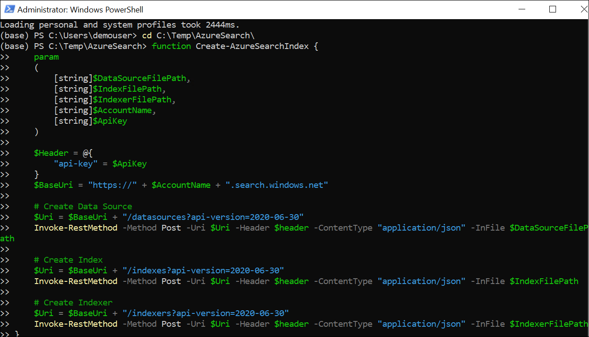

1. In the same PowerShell prompt, call this function for the `abstracts` index and the `covid19temp` index.

    Make sure to update the Azure Search account name and Azure Search API key in the below commands and then run.
   
     - Azure Search Account Name: **aiinaday-cog-<inject key="DeploymentID" enableCopy="false"/>**
     - Azure Search API key: You saved the **Primary admin key** in the notepad earlier, use that.

        ```powershell
        Create-AzureSearchIndex "C:/Temp/AzureSearch/abstracts_datasource.schema" "C:/Temp/AzureSearch/abstracts.schema" "C:/Temp/AzureSearch/abstracts_indexer.schema" "AZURE SEARCH ACCOUNT NAME" "API KEY"
        ```
    
        ```powershell
        Create-AzureSearchIndex "C:/Temp/AzureSearch/covid19temp_datasource.schema" "C:/Temp/AzureSearch/covid19temp.schema" "C:/Temp/AzureSearch/covid19temp_indexer.schema" "AZURE SEARCH ACCOUNT NAME" "API KEY"
        ```

        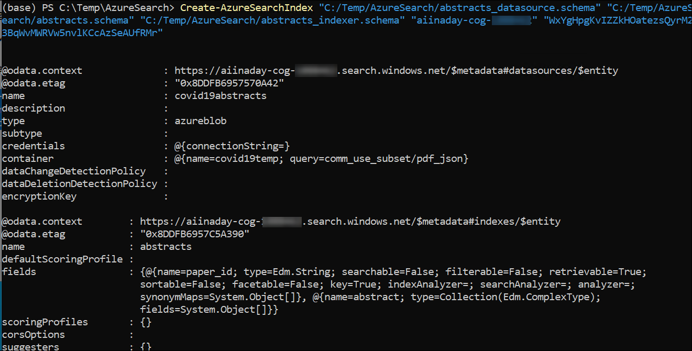

> **Congratulations** on completing the task! Now, it's time to validate it. Here are the steps:
> - Hit the Validate button for the corresponding task.
> - If you receive a success message, you can proceed to the next task. If not, carefully read the error message and retry the step, following the instructions in the lab guide.
> - If you need any assistance, please contact us at cloudlabs-support@spektrasystems.com. We are available 24/7 to help you out.

   <validation step="6e7f9bb9-9bed-4f51-ac7b-c6aa82222f50" />

## Task 4: Querying Azure Search Indexes

In this task, you’ll query the Azure Cognitive Search indexes to explore indexed COVID-19 datasets. You’ll practice running keyword searches, counting matching documents, retrieving specific fields, and generating a demo search application to visualize results.

1. Navigate to the [Azure portal](https://portal.azure.com), search for **Resource groups (1)** and select **Resource groups (2)** under Services.

    

1. Select the **AI-in-a-Day** resource group.

    

1. Locate **Search service** resource **aiinaday-cog-<inject key="DeploymentID" enableCopy="false"/>** and select it.

    

1. Select the **Indexes (1)** tab under **Search management** and ensure that you have two indexes created. If the Document Count is 0 for either, wait for a couple of minutes and select **Refresh (2)** until the document count appears.

    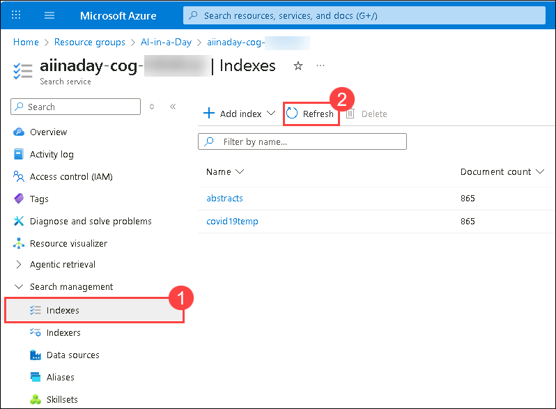

1. Once documents are available, navigate to **Overview (1)** of Search service and then select **Search explorer (2)** to open up the Search Explorer.

    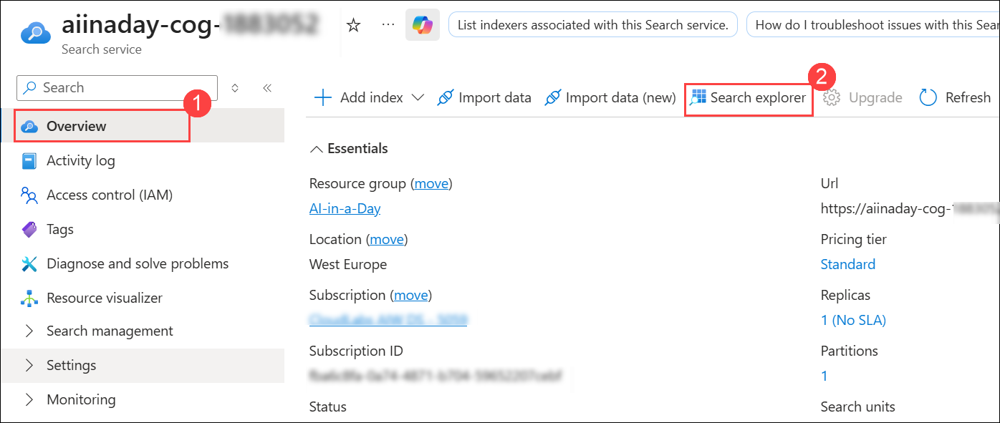

1. Choose the **covid19temp (1)** index and enter `RNA interference`**(2)** into the Query string input box, and then click **Search (3)**. This will return the documents which include the phrase "RNA interference."

    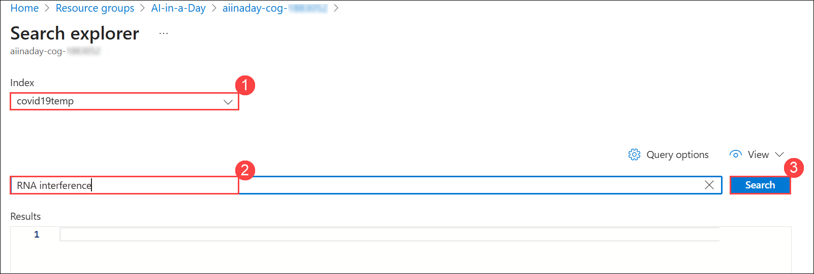

1. Keeping the **covid19temp (1)** index selected, we can also see how many articles match a certain search string. In the Query string input box, enter the phrase `Brazil&$count=true` **(2)** and then select **Search (3)**.  This will return 53 documents.

    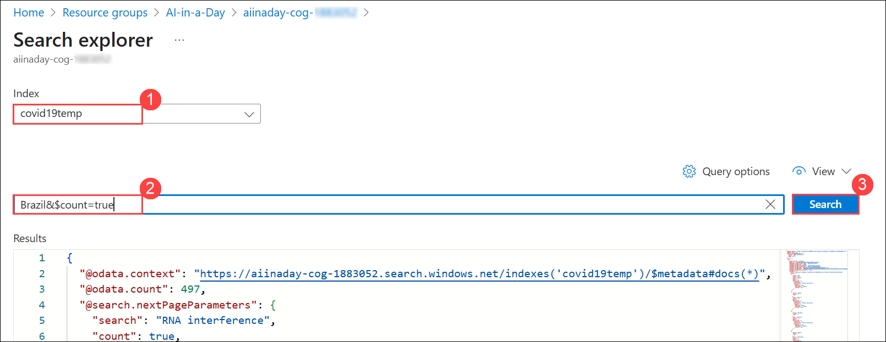

1. Keeping the **covid19temp (1)** index selected, in the Query string input box, enter the phrase `UNC Chapel Hill&$select=metadata/authors, metadata/title` **(2)** and then select **Search (3)**. This will return the title as well as detailed information on each author.

    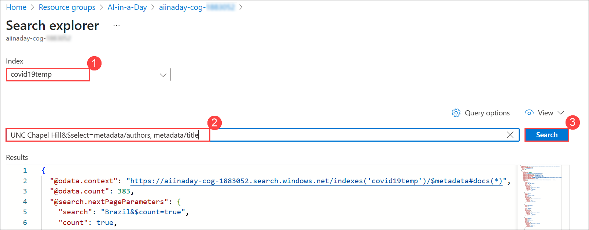

1. The Azure Search service can also generate a demo application. Return to the search service and select **Indexes (1)** from left pane under **Search management** and navigate to the **covid19temp (2)** index.

    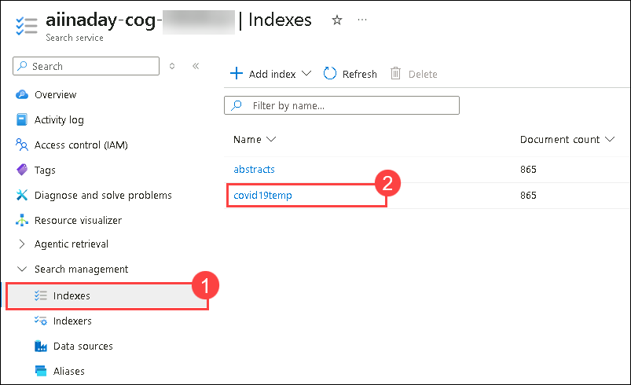

1. On the **covid19temp** index select the **Create Demo app** option.

    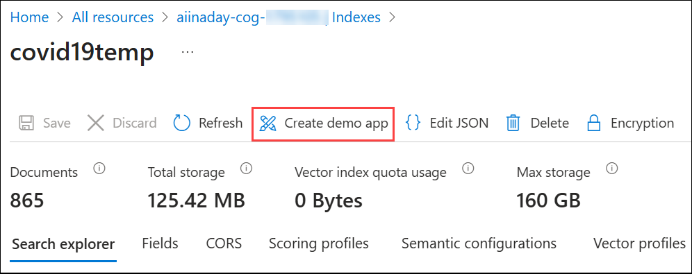

1. On **Create Demo app** page, under Customize individual result section, select **metadata.title** **(1)** for the Title and **abstract.text** **(2)** for the Description. Then click **Next (3)** twice to proceed. 

    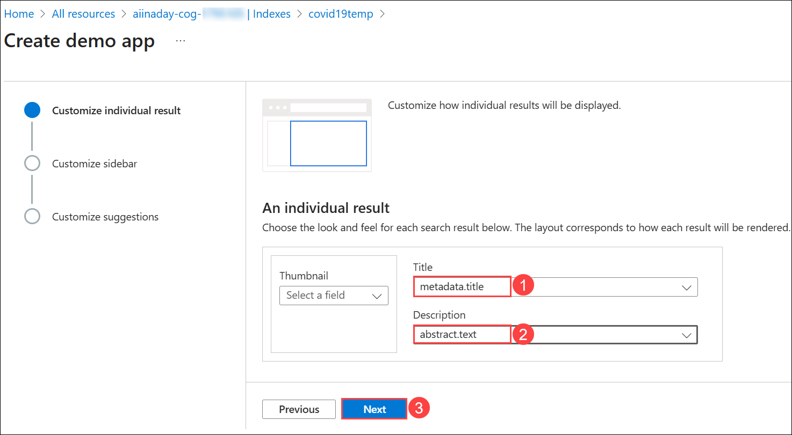

1. Now, click on **Create Demo App**. 

    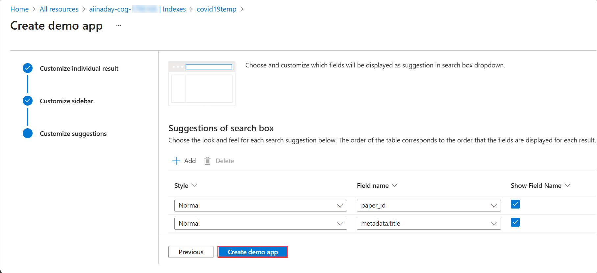

1. On the prompt **Your demo app is ready**, click **Download** to download an HTML file named `AzSearch.html`. 

    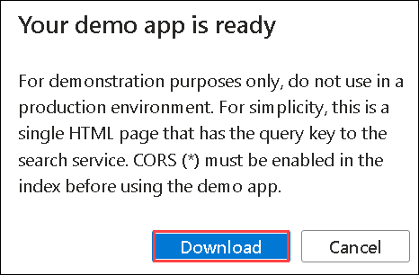

1. Open the HTML file named **AzSearch.html**.

    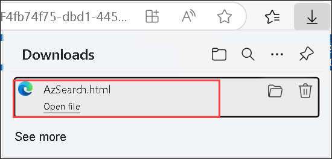

1. Open the demo app HTML file. In the search box, enter the phrase **RNA interference (1)** and click the **Search icon (2)**. This will return 497 papers relating to RNA interference.

    

## Task 5: Updating Azure Search Indexes

In this task, you’ll update the Azure Cognitive Search index by adding new documents to the storage account, running the indexer to refresh the index, and verifying that the updated content is searchable.

1. On the desktop, select the **Azure Storage Explorer** and open it.  

    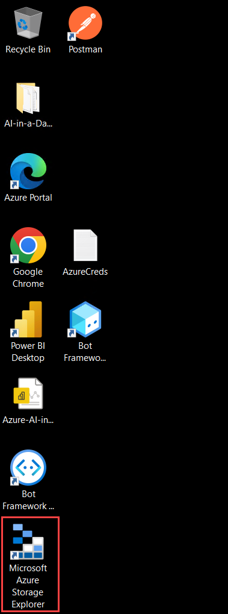

2. In the **Let Us Know What You Think** pane, **check (1)** the **Don't show this dialogue again** and click **Dismiss (2)**.

    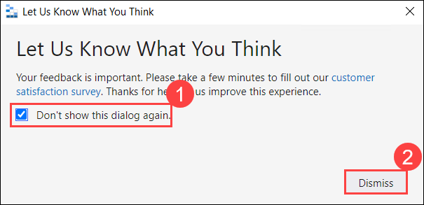

2. In the **Connect to Azure Storage** window, under the **Select Resource** section, select **Storage account or service**. 

    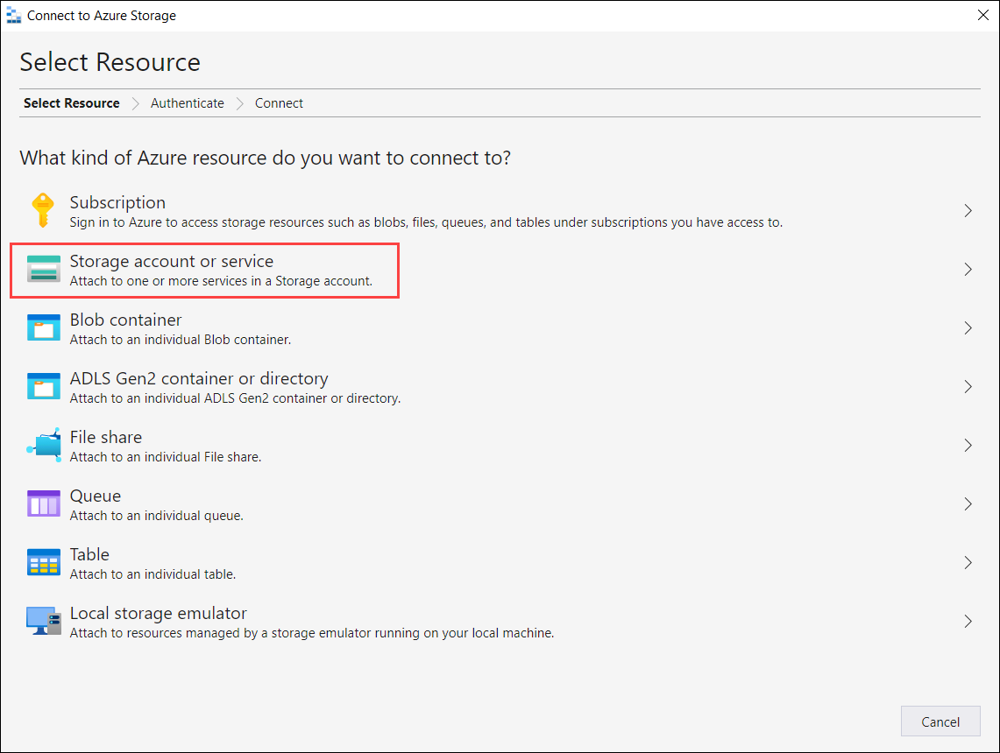

    >**Note:** If the Connect to Azure Storage window doesn’t appear, click **Connect (1)** from the left pane and then choose **Storage account or service (2)**.

    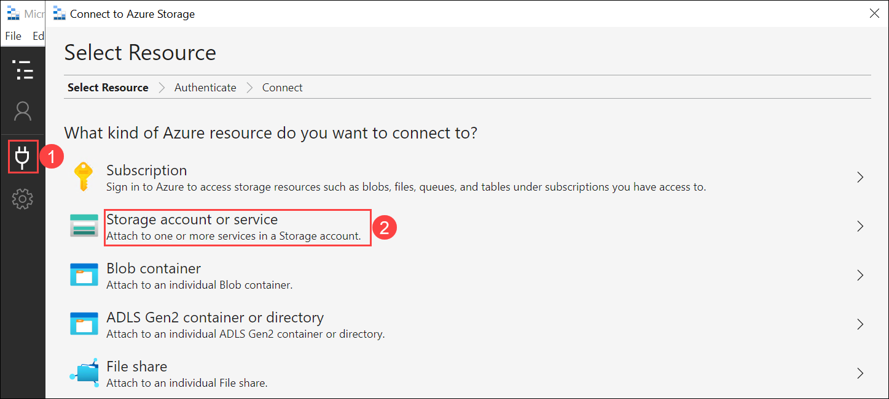

3. Select **Connection String (Key or SAS) (1)** under the **Select Connection Method** window and then select **Next (2)**.

    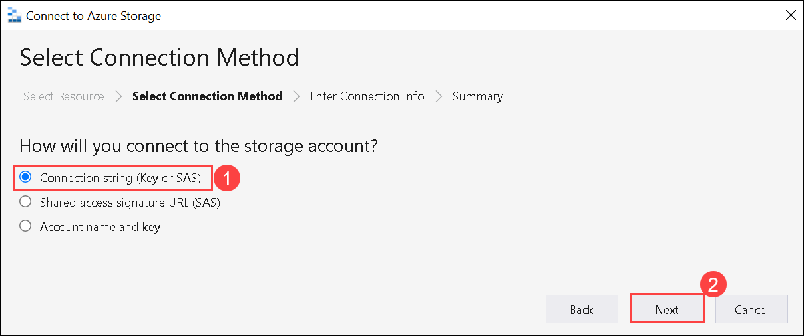

4. Enter your storage account **Connection string (1)** **<inject key="storageAccountConnectionString" enableCopy="true"/>**, and then click **Next (2)**. 

    > **Note:** Display name gets filled automatically when you add Connection string.

    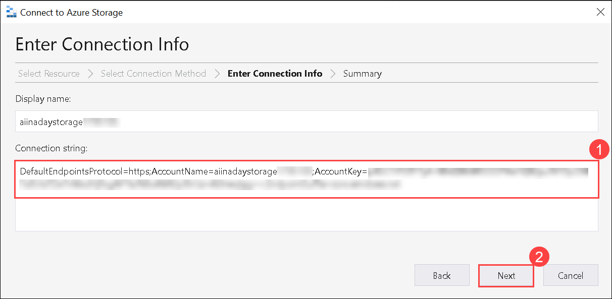

1. Review the details under the **Summary** and click **Connect** to complete the operation.

    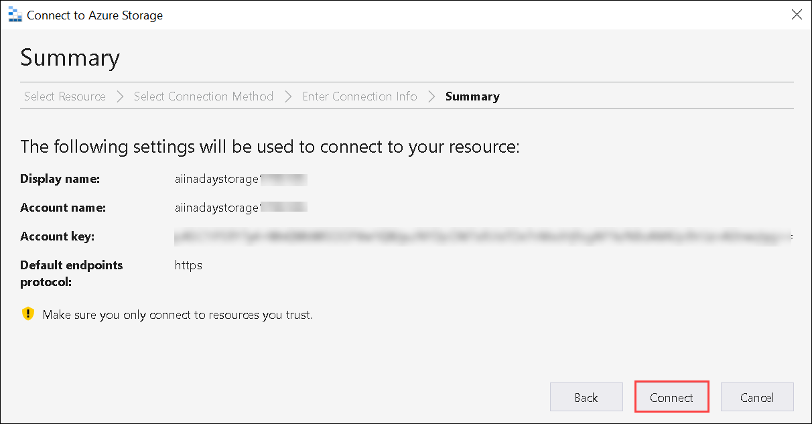

    >**Note:** In the **Microsoft Azure Storage Explorer** pop-up window, click **Ok**.

    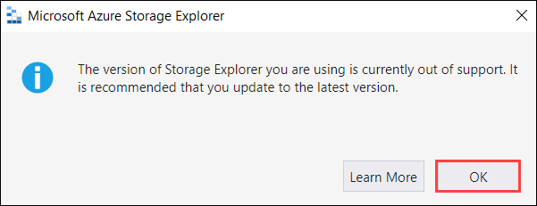

1. In **Azure Storage Explorer (1)**, navigate to the attached storage named **aiinadaystorage<inject key="DeploymentID" enableCopy="false"/> (2)**. Expand **Blob containers (3)** and select **covid19temp (4)**. Then, double-click the **comm_use_subset (5)** folder to open it.

    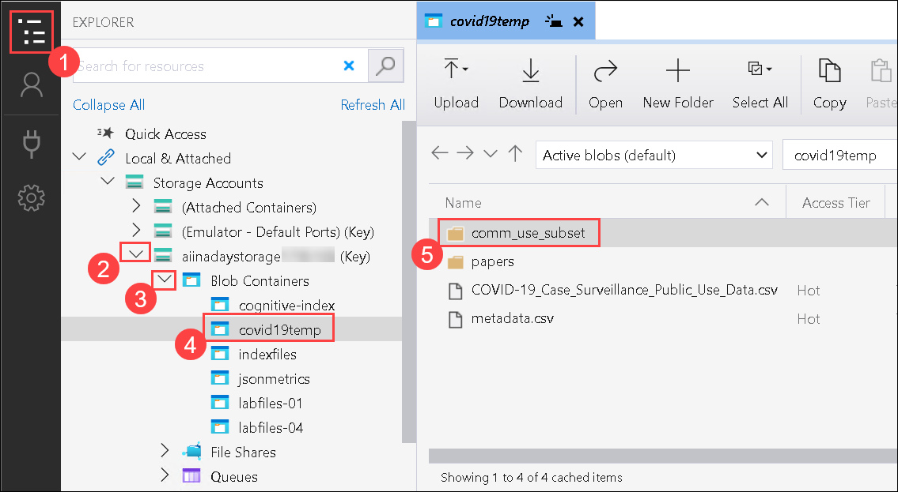

6. Select and open the **pdf_json_refresh** folder.

    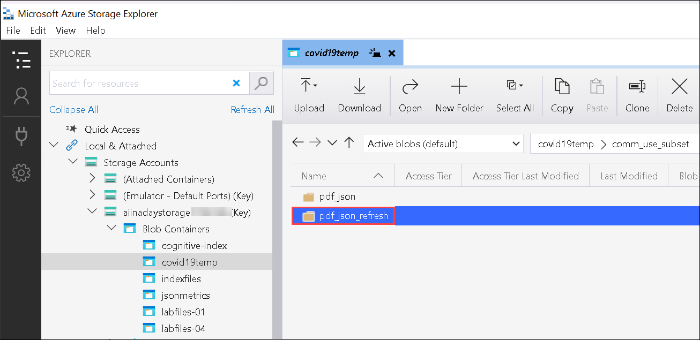

7. Then, in the **Select All (1)** menu, choose **Select All Cached (2)**. This will highlight all 100 records in the folder.  Select **Copy (3)** to copy these documents.
    
    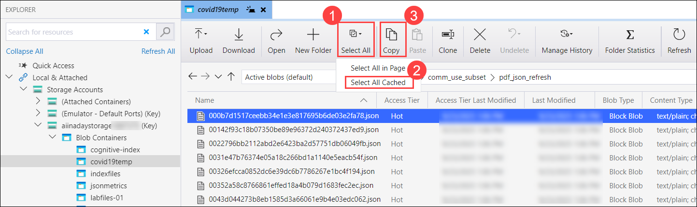

8. Navigate back to **comm_use_subset** by clicking the upward arrow.

    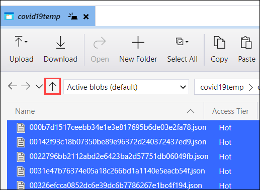

9. Then double-click on **pdf_json** to open.

    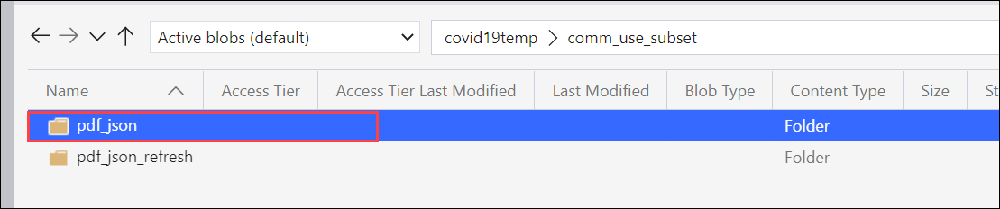

10. Inside this folder, click **Paste (1)** to paste the 100 documents into the **pdf_json** folder. Once the transfer is complete, you should see a total of **965 documents (2)**. You can also verify this from the **transfer completion message (3)** under the Activities section.

    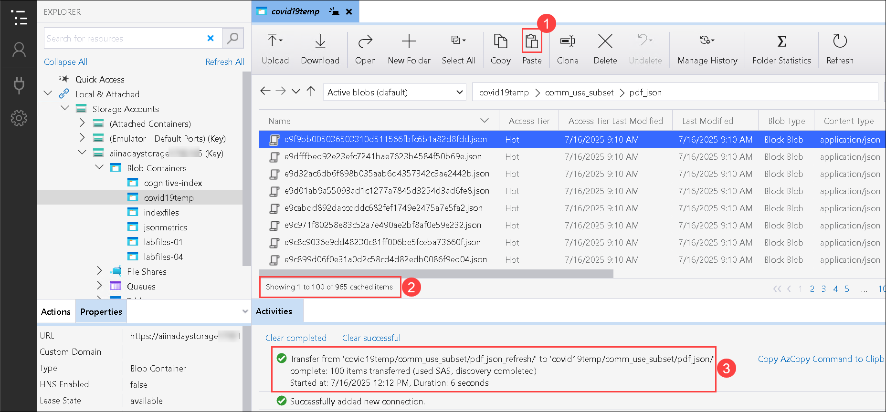

11. Navigate to the [Azure portal](https://portal.azure.com), search for **Resource groups (1)** and **select it (2)** under Services.

    

12. Select the **AI-in-a-Day** resource group.

    

13. Select the **aiinaday-cog-<inject key="DeploymentID" enableCopy="false"/>** Search service.

    

14. Navigate to the **Indexers (1)** section and select the **covid19temp (2)** indexer.

    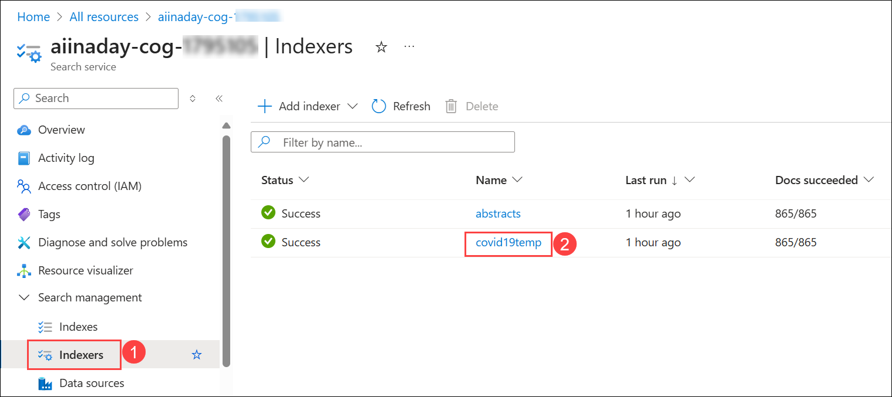

15. Select the **Run** option to process the 100 documents. Although we can configure an indexer to run periodically, this indexer will only run when manually engaged.

    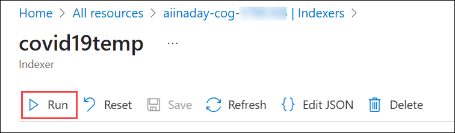

16. In the **Run indexer** wizard, click **Yes**.

    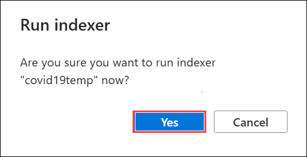

16. The indexer will run. It should be completed within 15-30 seconds to process the 100 new documents. You may need to select **Refresh** to see the indexer's progress.

    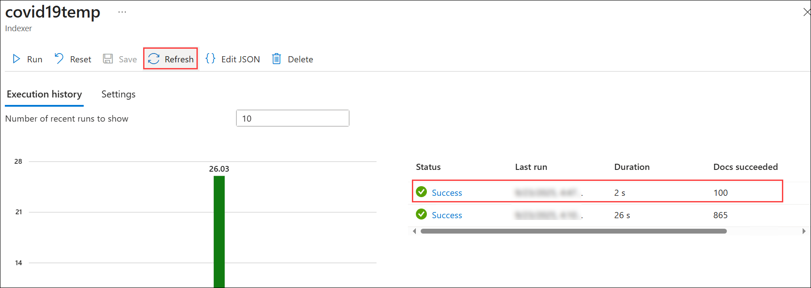

17. Return to the **Indexes (1)** tab for the Search service and ensure that the **covid19temp (2)** index has `965` documents. If it still reads 865, wait 30 seconds and select **Refresh** to check again.

    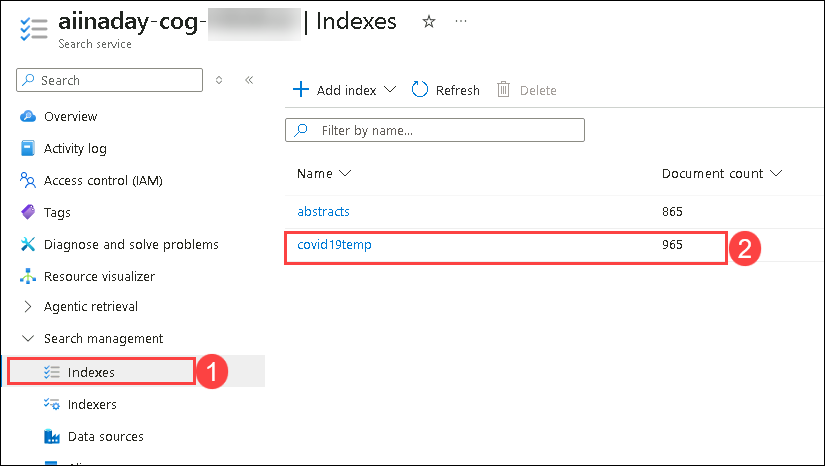

18. Select the **covid19temp** index to return to the Search Explorer. When we had 865 documents, 53 of them pertained to Brazil. We can confirm that this update was successful by entering `Brazil&$count=true` **(1)** and selecting **Search (2)**. This will now return 57 results **(3)** instead of the prior 53.

    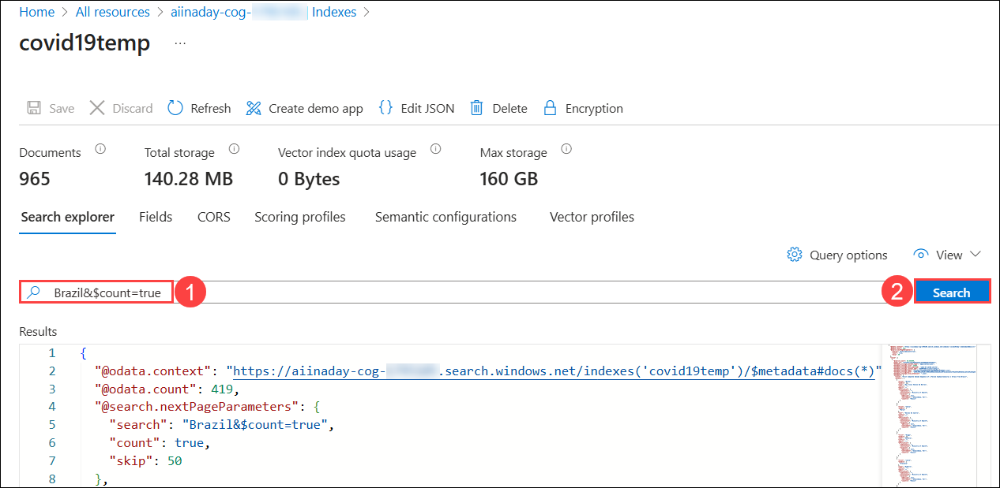

> **Congratulations** on completing the task! Now, it's time to validate it. Here are the steps:
> - Hit the Validate button for the corresponding task. If you receive a success message, you can proceed to the next task.
> - If not, carefully read the error message and retry the step, following the instructions in the lab guide. 
> - If you need any assistance, please contact us at cloudlabs-support@spektrasystems.com. We are available 24/7 to help you out.

<validation step="b927b6a3-f2fd-4047-9a54-233ef39525c5" />

>**Note**: If you face any issues on validation, please perform the next steps till the end of this lab and then click on validate button again.

## Task 6: Using the Document Intelligence Studio

In this task, you’ll use Document Intelligence Studio to create a custom model for extracting abstracts from research papers. This involves configuring storage access, labeling sample documents, training a model, and testing it to see how well it identifies and extracts the targeted data.

1. Navigate to the [Azure portal](https://portal.azure.com), search for **Resource groups (1)** and **select it (2)** under Services.

    

1. Select the **AI-in-a-Day** resource group.

     

1. Select the **aiinadaystorage<inject key="DeploymentID" enableCopy="false"/>** Storage account.

     

1. Under **Settings**, navigate to the **Resource sharing (CORS)** page. 

     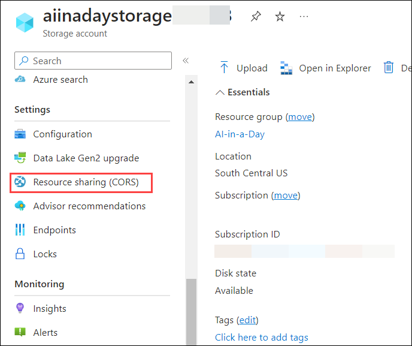
    
1. On the Resource Sharing (CORS) page, ensure that you are on the **Blob service** **(1)** tab, and enter the following values into the table and then click **Save** **(7)** to save the CORS settings.  

    | Parameter                   | Value                                              |
    | --------------------------- | -------------------------------------------------- |
    | Allowed origins             | Enter `https://formrecognizer.appliedai.azure.com` **(2)**  |
    | Allowed methods             | **Select all** methods **(3)**               |
    | Allowed headers             | Enter `*` **(4)**                                         |
    | Exposed headers             | Enter `*` **(5)**                                         |
    | Max age                     | Enter `200` **(6)**                                        |

     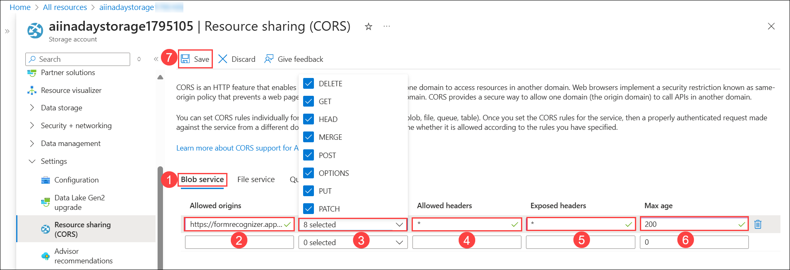

1. Navigate back to the **AI-in-a-Day** resource group and select the Document Intelligence resource **aiinaday-formrecog<inject key="DeploymentID" enableCopy="false"/>**.

     

1. Under **Resource Management**, select **Keys and Endpoint (1)** and click **Show Keys (2)**. Copy the values for **KEY 1 (3)** and **Endpoint (4)**, then save them in a notepad file for later use.

     

1. Go to the [Document Intelligence Studio](https://formrecognizer.appliedai.azure.com/) `https://formrecognizer.appliedai.azure.com/` and click the **Sign in** icon in the top-right corner.

    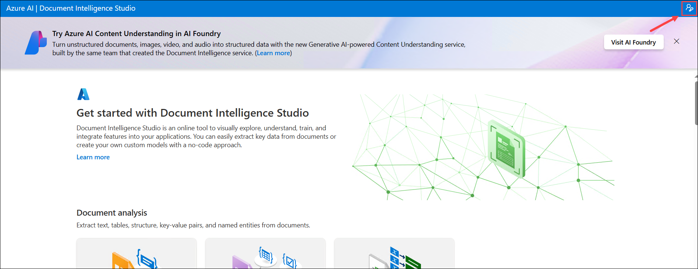
 
1. If prompted, select your user account.

     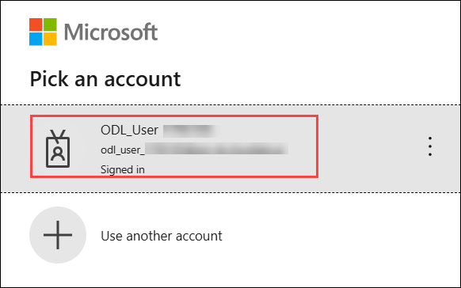

     >**Note:** If prompted, use the credentials provided in the **Environment** Tab to Sign-in.   
 
1. Scroll-down to **Custom models** and select **Get Started** under **Custom extraction model**. 

     

1. In the **Custom extraction models** page, under **My Projects** click on **+ Create a project**.
  
     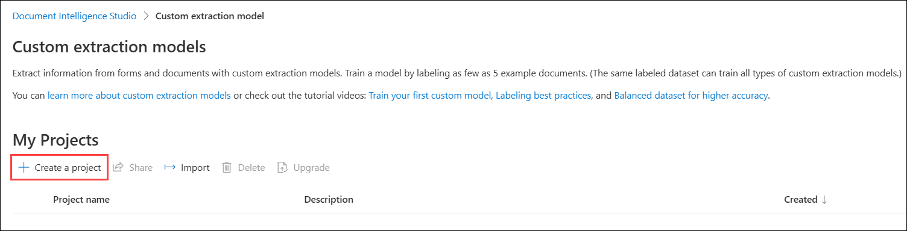

1. In the Enter Project Details pane, enter the Project Name as **covid19abstract (1)** and add the description as **Extracting Abstract from the documents (2)**, then click **Continue (3)** to proceed.

     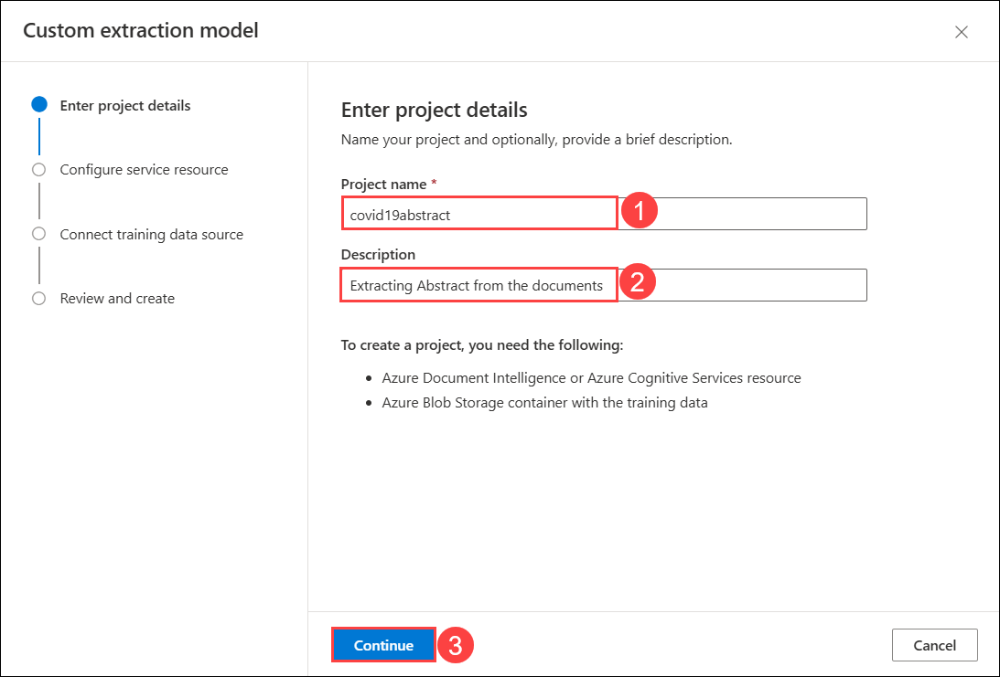
    
1. In the **Configure service resource**, provide the following details, then click **Continue (4)** to proceed.
   
    | Parameter                   | Value                                |
    | --------------------------- | -------------------------------------|
    | Subscription                | Select the default subscription  **(1)**    |
    | Resource Group              | Select `AI-in-a-Day` **(2)**                |
    | Document Intelligence or Cognitive Service Resource| Select **aiinaday-formrecog<inject key="DeploymentID" enableCopy="false"/>** **(3)**|
    
    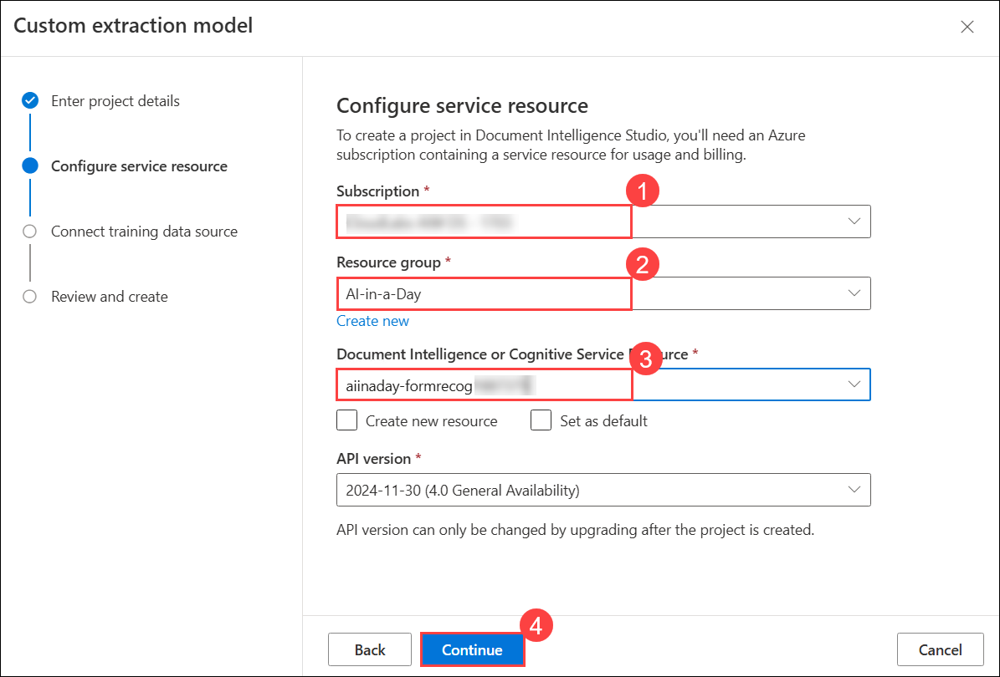
    
1. Next in the connect training data source, select the below values from the drop-down and click on **Continue (6)**.

    | Parameter                   | Value                                |
    | --------------------------- | -------------------------------------|
    | Subscription                | Select the default subscription **(1)**     |
    | Resource Group              | Select `AI-in-a-Day` **(2)**                |
    | Storage account             | Select **aiinadaystorage<inject key="DeploymentID" enableCopy="false"/>** **(3)** |
    | Blob container              | Select `covid19temp` **(4)**                 |
    | Folder path                 | Enter `papers` **(5)**                      |

     
    
      > **Note**: If you are unable to select the Storage Account in the Connect training data source page, signout and signin from the Document Intelligence Studio with the given credentials. Re-perform the task from Step-8.

1. Review the details and click on **Create project**.

     

1. In the **Start labeling now** pop-up window, click **Skip**.

    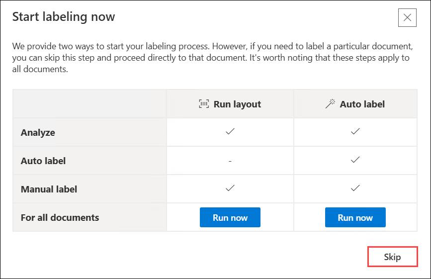
  
1. After creating a new project, you will be sent to the project for tagging in Label data. Select **+Add a Field** **(1)** to create a new field click on **Field** **(2)**.

     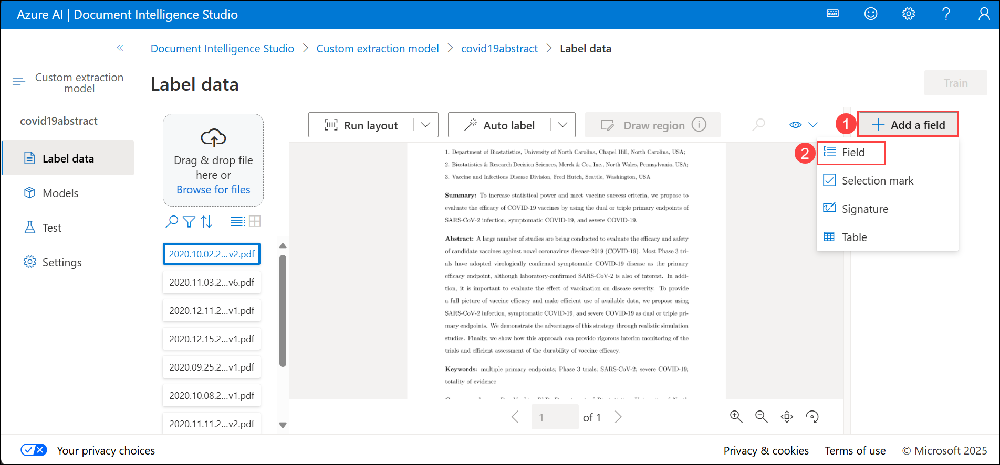

1. Type `Abstract` **(1)** in the Field, and hit **enter**. By this, you have created a new Abstract Field.

1. Click on **Run Layout (2)** and wait for the layout to complete for the first document. Locate the document’s abstract. 

   >**Note:** In some documents, the abstract may be on the second page. However, after running the layout, the abstract may not be automatically detected, and all text might be highlighted in yellow. In this case, you will need to manually select each word in the abstract before tagging.

    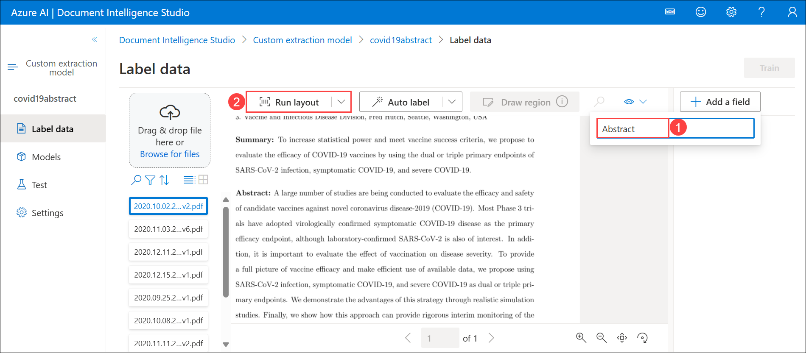

1. Once the layout is generated for the first document, move on to the next document. We will tag each of the five papers, so navigate to each in turn, allowing the layout to be processed. To ensure tagging is successful, you must first run the layout for a document, navigate to another document, and then return to the first document before beginning the tagging process. Layout generation happens only once per document, so after it is generated, you can return to the document and proceed with tagging.

    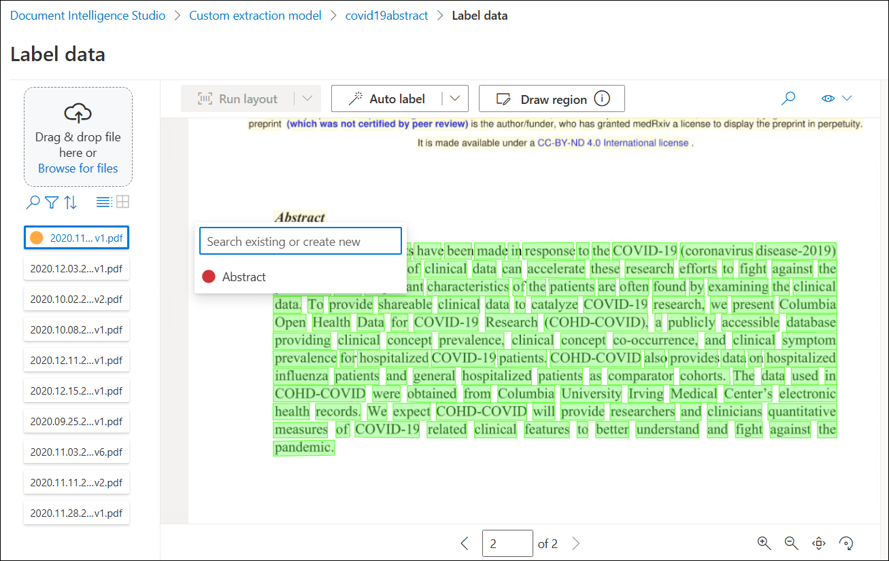

1. Before selecting the words, make sure to **Run Layout** then only you will be able to select the words.

1. Go back to the **second PDF (1)** and manually select each word in the **Abstract (2)** section. Once highlighted, select the **Abstract tag (3)** to tag this section. You will need to select each word individually rather than selecting a box. After tagging, you should see a tag logo next to the PDF. If the tag logo appears, it confirms that tagging was successful for this document.

     

1. Return to the **first PDF (1)** and ensure **Run Layout (2)** has already been completed. Highlight the **ABSTRACT (3)** if the abstract is lengthy,it is okay to include just the first paragraph. Then, select the **Abstract (4)** tag to tag this document. Ensure that the viewed icon (an eye) changes to a **tag icon (5)**, indicating successful tagging.
   >**Note:** If it does not change to a tag but instead changes to a blank spot without any icons, tagging was unsuccessful. In the event that tagging is unsuccessful, select another document, wait for it to have its layout run, and then return to the prior document and try tagging again.

     

1. Continue tagging until all five of the top papers are tagged. Once we have tagged five documents, select the **Train** option.
    
     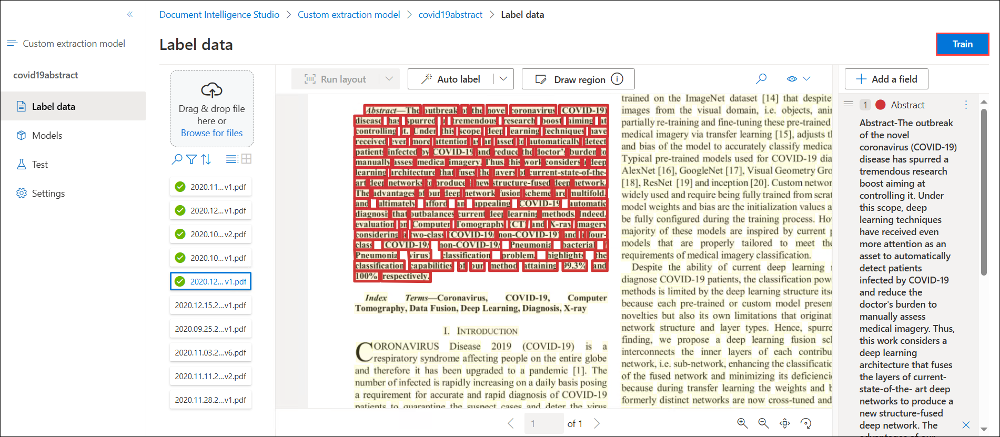

1. In a pop-up to Train a new model, enter **Abstracts (1)** as the ModelID, and select the **Neural (Recommended) (2)** from the drop-down as Build Mode. Then click on **Train (3)**.

     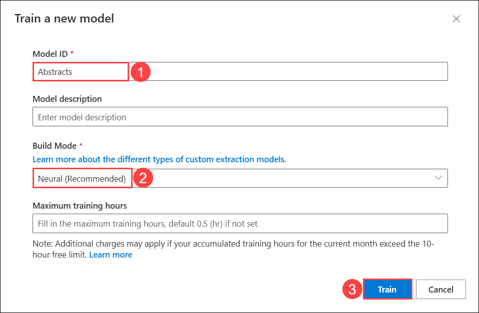

1. Training a model may take up to 45-60 minutes to succeed. Click on **Go to Models**. 

     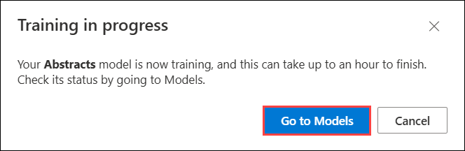

     >**Note**: As Training a model will take up to 45-60 minutes to succeed. No need to wait for it, you can continue with next Lab. Come back later and review it after an hour.

1. After the model has finished training, you will see that the Status has succeeded.  Although the estimated accuracy is not great, but we will use this model.

     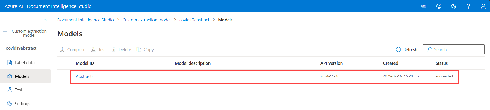

1. From the left menu, select the **Test (1)**. Click on **Browse for a file (2)**. 

     
    
1. In the Upload Files pop-up, Navigate to `C:\Temp\AzureSearch\` **(1)**, select `2020.09.25.20201616v1.pdf` **(2)** file and click on **Open** **(3)**.
    
     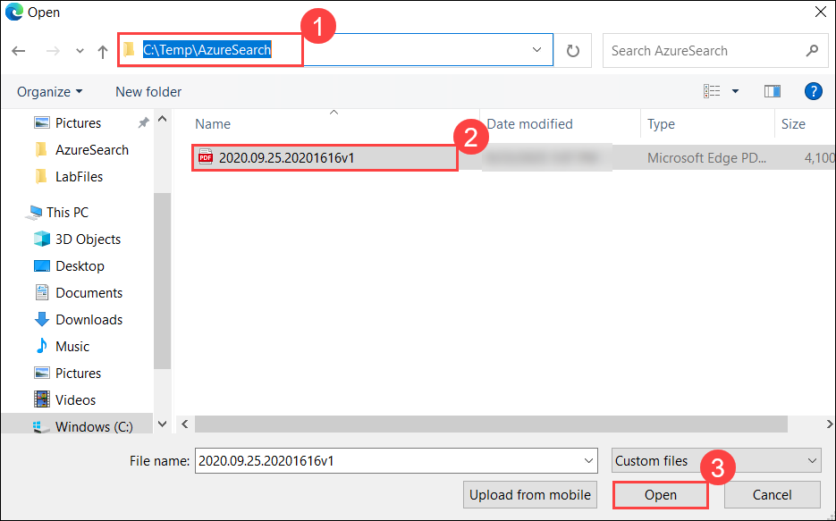
   
1. Choose `2020.09.25.20201616v1.pdf` file, select **Run Analysis (1)**. Note that the abstract is on **page 2 (2)** of the PDF. View the **Results (3)** on the right side of the page.
    
     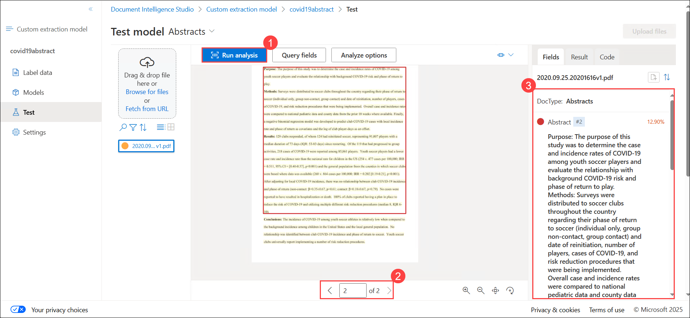

1. Select **Result (1)** and click on **download icon (2)** to download JSON file. Find the location where the script was downloaded and observe the result code.

     
    
1. For now, you have used custom models with Neural build mode. You can use any sample document which contains Tables and Signatures to Test/Analyze using Template build mode. Please find the reference to explore more about Document Intelligence Studio: [Quickstart: Document Intelligence Studio - Azure Applied AI Services | Microsoft Docs](https://learn.microsoft.com/en-us/azure/ai-services/document-intelligence/overview?view=doc-intel-3.1.0)

> **Congratulations** on completing the task! Now, it's time to validate it. Here are the steps:
> - Hit the Validate button for the corresponding task.
> - If you receive a success message, you can proceed to the next task. If not, carefully read the error message and retry the step, following the instructions in the lab guide.
> - If you need any assistance, please contact us at cloudlabs-support@spektrasystems.com. We are available 24/7 to help you out.

<validation step="24474dca-c3ab-413f-ba34-eb278f3c895f" />

## Task 7: Document Summarization via AI Service for Language Integration

Summarization is one of the features offered by [Azure AI Service for Language](https://docs.microsoft.com/en-us/azure/AI-services/language-service/overview), a collection of machine learning and AI algorithms in the cloud for developing intelligent applications that involve written language. Use this article to learn more about this feature, and how to use it in your applications.

In general, there are two approaches for automatic document summarization: extractive and abstractive. This API provides extractive summarization. Extractive summarization is a feature that produces a summary by extracting sentences that collectively represent the most important or relevant information within the original content. This feature is designed to shorten content that users consider too long to read. Extractive summarization condenses articles, papers, or documents to key sentences. The AI models used by the API are provided by the service, you just have to send content for analysis.

In this task, we are creating a text summarization application with the client library for Python. You will create a Python application that can summarize documents or text-based customer service conversations.

1. Return to the Azure Portal page and navigate to the **AI-in-a-Day** resource group and select the Azure AI services multi-service account **aiinaday-cogsv<inject key="DeploymentID" enableCopy="false"/>**.

     

2. Select the **Keys and Endpoint (1)** option under **Resource Management**.  Then, copy the value for **KEY 1 (2)** and the **Endpoint (3)**.     Paste these into notepad for later use.

     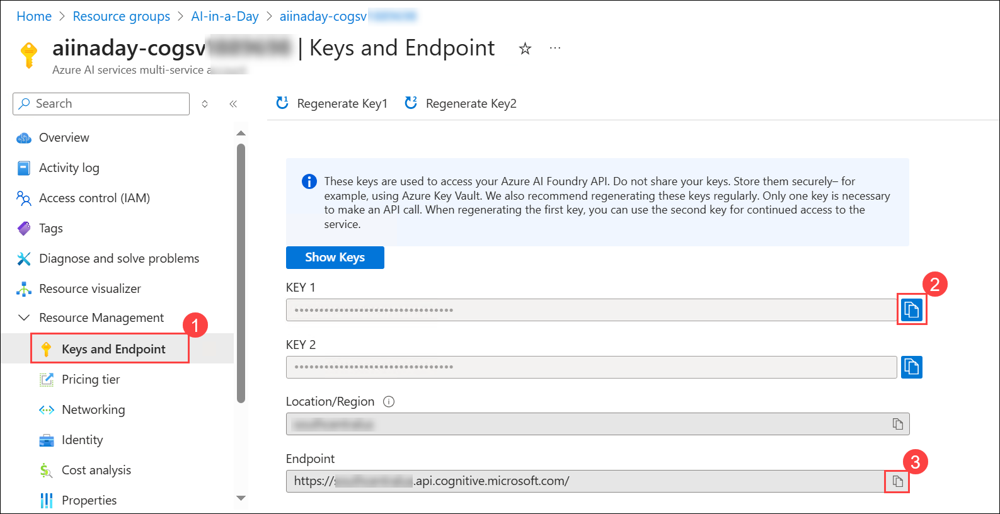

3. In the labvm, open a command prompt (`cmd.exe`). To do this, open the Windows menu, type in `CMD` **(1)**, and select the **Command Prompt (2)** application.

     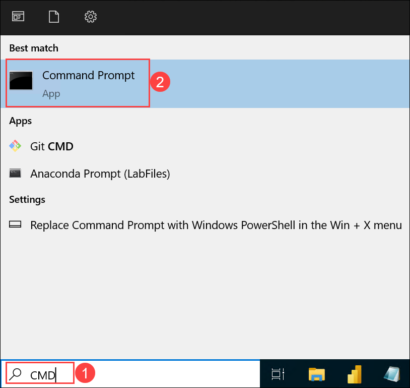

4. Run the below command. 

    >**Note:** To run this, you must have Python installed on the machine. If `python.exe` is not accessible as part of the path--meaning you get an error when trying to run `pip`, navigate to where Python is installed.  The `pip.exe` program is inside the `\Scripts\` folder.

    ```bash
    C:\Python312\python.exe -m pip install --upgrade azure-ai-textanalytics
    ```

    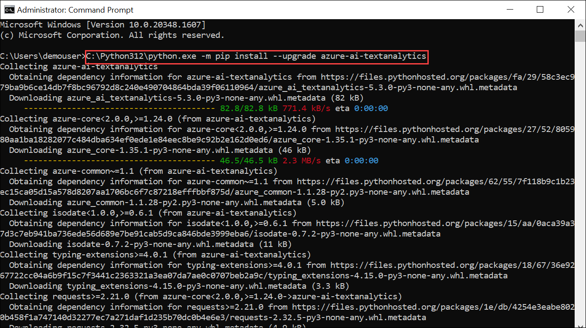

5. Open **File Explorer** and navigate to the path `C:\Temp\AzureSearch\` **(1)**. Select the file named **summarization.py (2)** and open it in **Notepad or IDLE**. 

     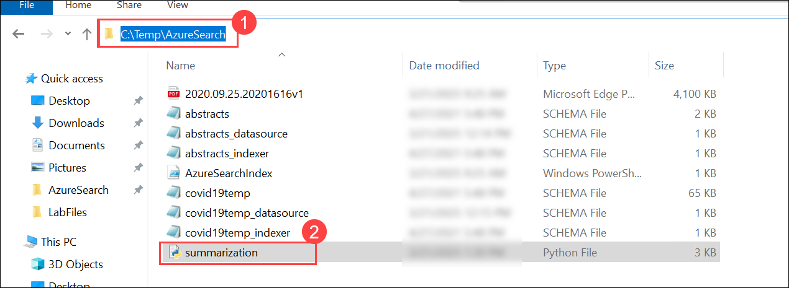

6. Replace the **key** and **endpoint** in the file with AI services multi-service account named **aiinaday-cogsv<inject key="DeploymentID" enableCopy="false"/>** which you have already copied in step-2 of the same task and finally save the file.
    
     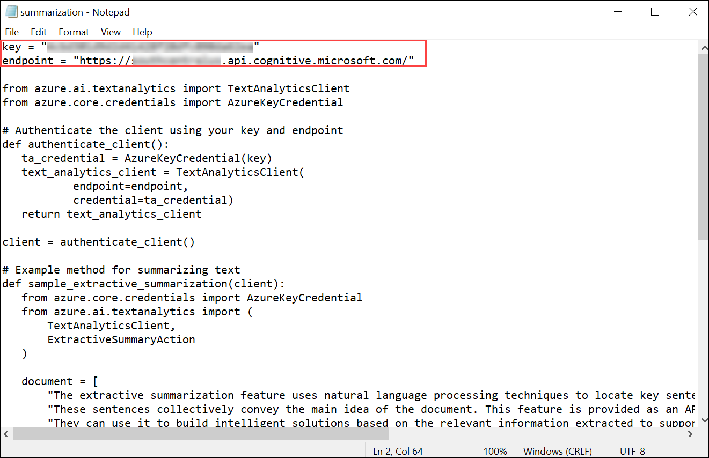 

7. Navigate to the command prompt and run the following commands:

   ```bash
   cd C:\Temp\AzureSearch\
   ```

   ```bash
   C:\Python312\python.exe summarization.py
   ```
   
     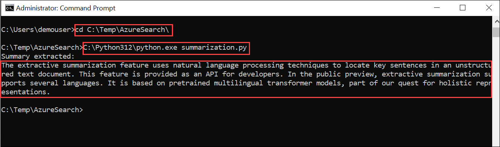

> **Congratulations** on completing the task! Now, it's time to validate it. Here are the steps:
> - Hit the Validate button for the corresponding task.
> - If you receive a success message, you can proceed to the next task. If not, carefully read the error message and retry the step, following the instructions in the lab guide.
> - If you need any assistance, please contact us at cloudlabs-support@spektrasystems.com. We are available 24/7 to help you out.

<validation step="9783aabe-40ad-4cba-b3b6-6b1a967e27c6" />

You can find more references about Document Summarization from here: [Quickstart: Get started with Language Studio - Azure AI Services | Microsoft Docs](https://docs.microsoft.com/en-us/azure/AI-services/language-service/language-studio). Use this article to learn about Language Studio, and testing features of Azure AI Service for Language Integration.

## Summary 

In this lab, you have explored Azure Document Intelligence and AI Services and extracted, analyzed, and summarized key information from documents.

### You have successfully completed the Lab 2. Click on Next >> to proceed with the next Lab.


