# Lab 3: Knowledge Mining with Azure AI Search

### Estimated Duration: 2 Hours

## Overview

This lab covers Azure AI Search Services, particularly [Semantic ranking](https://docs.microsoft.com/en-us/azure/search/semantic-ranking) using [semantic query](https://docs.microsoft.com/en-us/azure/search/semantic-how-to-query-request?tabs=semanticConfiguration%2Cportal#create-a-semantic-configuration) and [return a semantic answer](https://docs.microsoft.com/en-us/azure/search/semantic-answers?tabs=semanticConfiguration).

Semantic search is a premium feature in Azure AI Search that invokes a semantic ranking algorithm over a result set and returns semantic captions (and optionally semantic answers), with highlights over the most relevant terms and phrases. Both captions and answers are returned in query requests formulated using the "semantic" query type.

The semantic ranking is an extension of the query execution pipeline that improves precision by reranking the top matches of an initial result set. In order to complete processing within the expected latency of a query operation, inputs to the semantic ranker are consolidated and reduced so that the underlying summarization and reranking steps can be completed as quickly as possible.

>**Note:** Ensure to complete Lab 2 before proceeding with this lab.

## Lab Objectives

- Task 1: Enabling the Semantic ranker in the AI Search service
- Task 2: Creating a Semantic Configuration
- Task 3: Semantic search using the semantic configuration in Azure Portal
- Task 4: Semantic Query using REST APIs

## Task 1: Enabling the Semantic ranker in the AI Search service

In this task, you’ll enable the Semantic ranker in the Azure AI Search service and apply the free tier plan to enhance search results with semantic ranking.

1. Navigate to **AI-in-a-Day** resource group in the [Azure portal](https://portal.azure.com).

   

2. Locate **Search service** resource **aiinaday-cog-<inject key="DeploymentID" enableCopy="false"/>** and select it.

    
   
3. In the left-hand pane, under **Settings** section, choose **Semantic ranker (1)**. In the Semantic ranker pane, click **Select Plan (2)** and choose the **Free** tier. This will apply the free tier plan to your Semantic search.

    
   
## Task 2: Creating a Semantic Configuration

In this task, you’ll create a semantic configuration for the `covid19temp` Azure Search index to define how search results are ranked and displayed based on selected title, content, and keyword fields.

1. Navigate to the **Search service** resource **aiinaday-cog-<inject key="DeploymentID" enableCopy="false"/>** and then select **Indexes (1)** under the **Search management**. You will be able to see the list of indexes, click on the **covid19temp (2)** index for adding semantic configuration.

    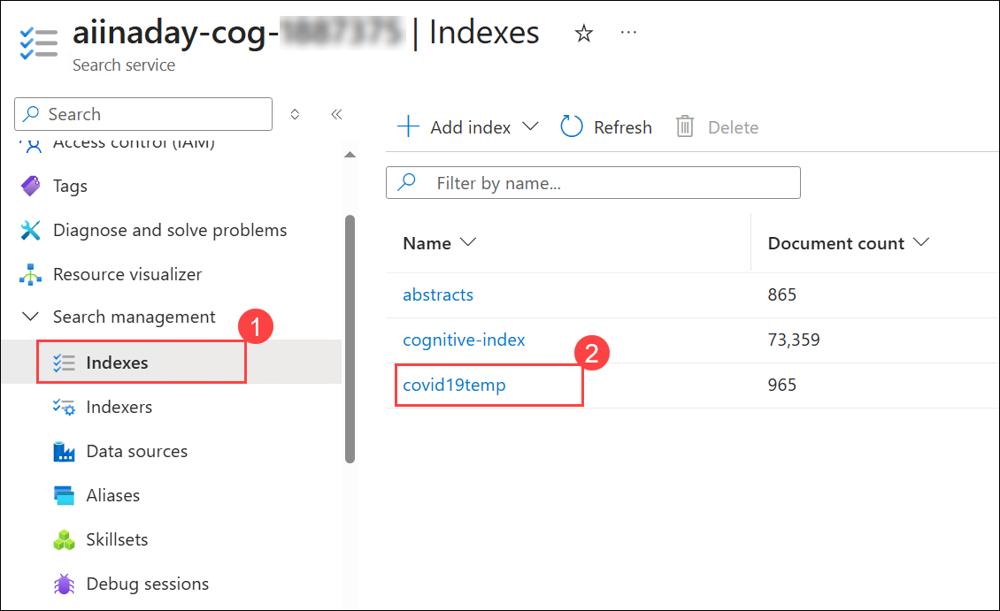
   
2. In the **covid19temp** index pane, select **Semantic configurations** **(1)** and click on **+ Add semantic configuration** **(2)**.

    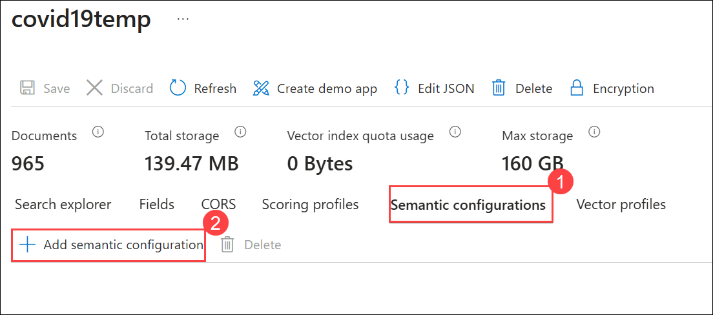

3. You will see a tab appear on the right side with **New semantic configuration**. Enter the following details, then click on **Save** **(5)**.

    | Parameter                   | Value                                        |
    | --------------------------- | -------------------------------------------- |
    | Name                     | **my-semantic-config (1)**                          |
    | Title field              | Select `metadata/title` **(2)** from the drop-down   |
    | Field name under Content fields  | Select `bib_entries/BIBREFO/title` **(3)** from the drop-down |
    | Field name under Keyword fields     | Select `bib_entries/BIBREFO/ref_id` **(4)** from the drop-down |
  
    
  
4. You will now see the added **semantic configuration (1)** listed under the Semantic configurations tab. Click **Save (2)** to apply and save the changes.

    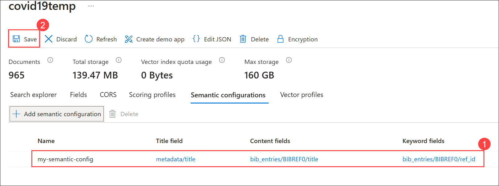

## Task 3: Semantic search using the semantic configuration in Azure Portal

In this task, you’ll perform a semantic search on the `covid19temp` index using the previously created semantic configuration to retrieve and rank results based on meaning rather than just keyword matches.

1. Navigate to the **Overview (1)** section of the **Search service** resource named **aiinaday-cog-<inject key="DeploymentID" enableCopy="false"/>**, then click on **Search explorer (2)** to proceed.

    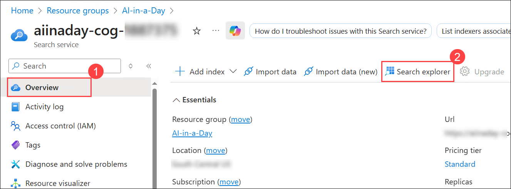
   
2. In the **Search explorer** pane, select the Index as **covid19temp** **(1)**. Click on the **Query options** **(2)**.
    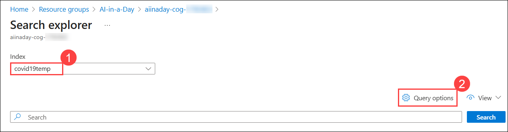

3. In the panel that appears on the right, ensure that **Semantic ranker** is switched **On (1)** and that **my-semantic-config (2)** is chosen under Semantic configuration. Then, click **Close (3)**. 

    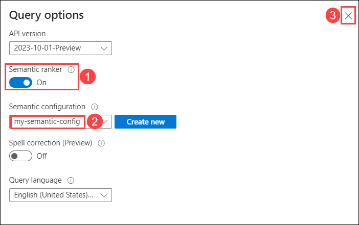
   
4. Click on **Search (1)**. Wait a few seconds for the search to complete, then scroll down to the **Results (2)** section on the same page. You should now see the output of the semantic search using the selected semantic configuration.

    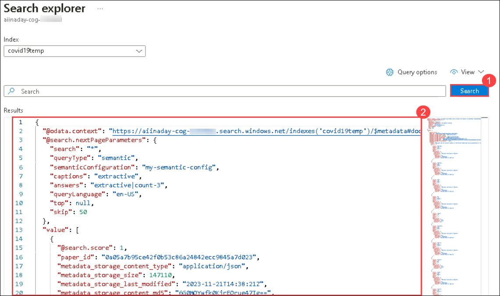
   
## Task 4: Semantic Query using REST APIs

In this task, you are going to perform the semantic search using a query in [REST APIs](https://docs.microsoft.com/en-us/azure/search/search-get-started-rest). For now, you will perform with [Postman desktop app](https://www.getpostman.com/) to send requests to Azure AI Search.
   
1. In the **Search service** pane for **aiinaday-cog-<inject key="DeploymentID" enableCopy="false"/>**, go to **Keys (1)** in the **Settings** section on the left. Under **Manage query keys**, copy the **Key (2)** and paste it into **Notepad** for future use.

    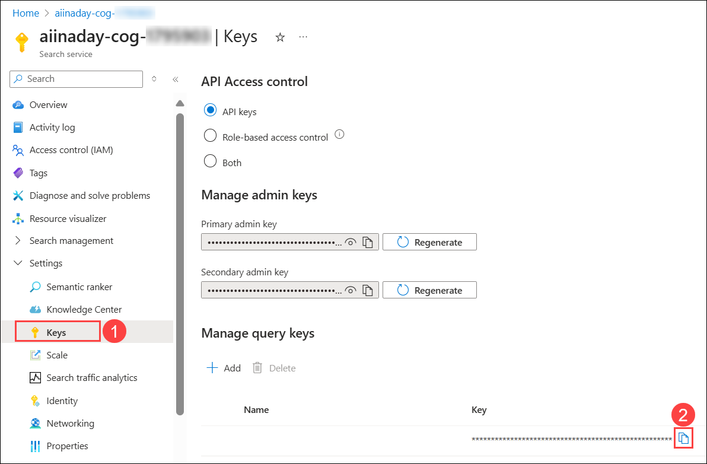
   
1. Navigate to **LabVM Desktop** and open the **Postman** application by double-clicking on it.

     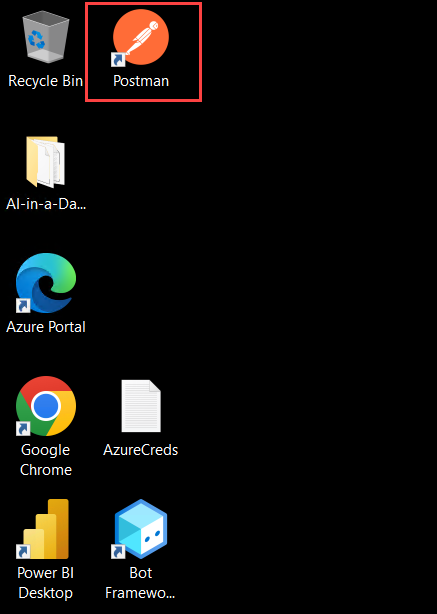

1. If a Postman update prompt appears, select **Dismiss**.

    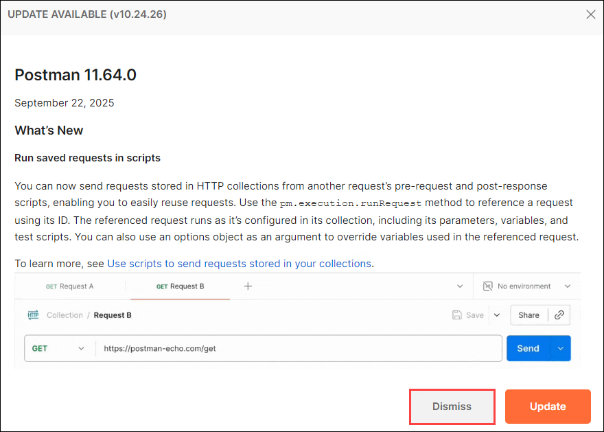

1. In the Overview page of the **Postman** application, click on **Create a request** under Get started.

     
   
1. Select the **POST (1)** method from the drop-down menu. Then, enter the request URL provided below, making sure to replace the search service name with **aiinaday-cog-<inject key="DeploymentID" enableCopy="false"/>** and the index name with **covid19temp**.

   `https://[search-service-name].search.windows.net/indexes/[index-name]/docs/search` **(2)**.
   
     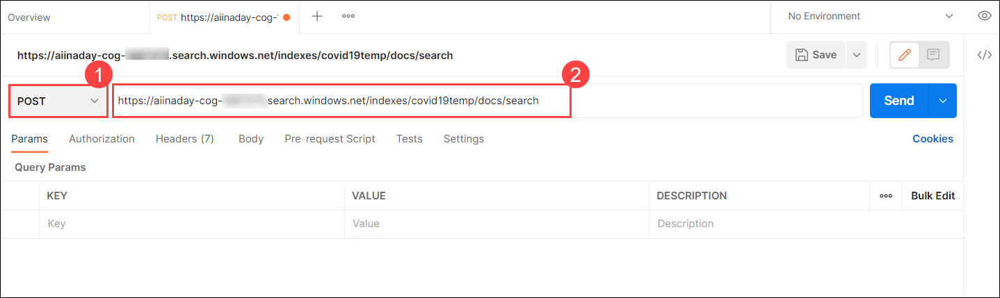

1. In the **Parameters** section, enter the below values for **api-version** **(1)** and **api-key** **(2)**.

    | Key           | Value                                        |
    | --------------------| -------------------------------------------- |
    | api-version         | **2021-04-30-Preview (1)**                           |
    | api-key             | Enter the manage query key which you have copied earlier in Step - 2  **(2)**  |
   
   After updating the parameters, your **Request URL** **(3)** should be the same as shown in the below screenshot.
   
     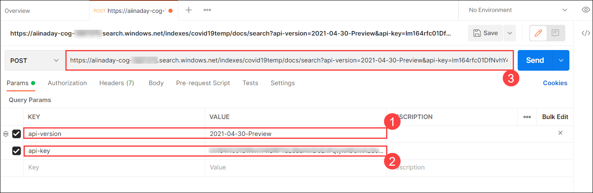

1. To add a query:
     - Select the **Body (1)** section.
     - Click on **raw (2)** as the code type.
     - From the drop-down, choose **JSON (3)** as the format.
     - Copy and paste the query provided below into the **coding area (4)**.
     - Click **Send (5)** to execute the request.
 
       ```bash
       {
          "search": "What is Endoplasmic Reticulum",
          "queryType": "semantic",
          "queryLanguage": "en-us",
          "semanticConfiguration": "my-semantic-config",
          "answers": "extractive|count-3",
          "captions": "extractive|highlight-true",
          "count": "true"
       }
       ```
   
          
   
1. You’ll see a **Sending request** message in the **Response** section, which may take a few seconds to complete. Once the response is received, ensure that the **Network Status shows 200 OK**. Then, review the response content and feel free to explore further using your own query requests.

    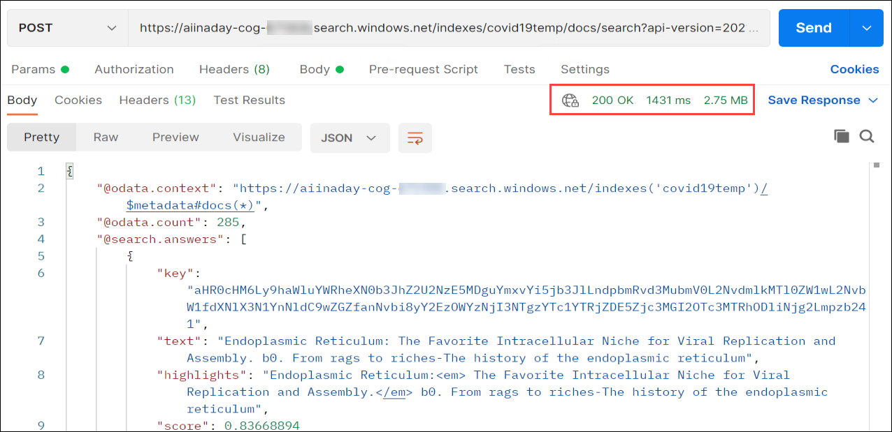

> **Congratulations** on completing the task! Now, it's time to validate it. Here are the steps:
> - Hit the Validate button for the corresponding task.
> - If you receive a success message, you can proceed to the next task. If not, carefully read the error message and retry the step, following the instructions in the lab guide.
> - If you need any assistance, please contact us at cloudlabs-support@spektrasystems.com. We are available 24/7 to help you out.

<validation step="5f84e298-cac3-40e0-aad7-2eea5eefe286" />

>**Note**: If you face an issue that the request failed with 401 Forbidden or 403 Forbidden error, this might be caused due to passing invalid authentication credentials or an invalid api-key. For more information, reference this link ```https://docs.microsoft.com/en-us/rest/api/searchservice/http-status-codes#common-http-status-codes```

## Summary

In this lab, you worked on indexing and exploring data, extracting insights, and enabling advanced search capabilities across structured and unstructured content.

### You have successfully completed the Lab 3. Click on Next >> to proceed with the next Lab.

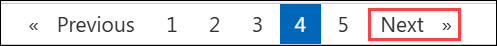
