# Lab 4: Conversational AI with Microsoft Copilot Studio

### Estimated Duration: 1 Hour 30 Minutes

## Overview

Conversational AI with Microsoft Copilot Studio allows users to create and deploy sophisticated chatbots with no code, enabling automated interactions and enhanced customer engagement through intuitive, customizable conversational flows.

In this lab, you will use Microsoft Copilot Studio to build a no-code conversational AI experience. You will set up your Copilot environment, create topics, design conversational flows, and test your custom Copilot for real-time interactions.

## Lab Objectives

- Task 1: Explore lab scenario
- Task 2: Setting up Microsoft Copilot Studio and Create your first Copilot
- Task 3: Create a New Topic
- Task 4: Test your Copilot

## Task 1: Explore lab scenario

The power of Machine Learning also comes into play when dealing with human-to-machine interfaces. While classical interfaces like native or web applications are ubiquitous, the new approaches based on conversational AI are becoming increasingly popular. Having the capability to interact with intelligent services using natural language is quickly becoming the norm rather than the exception. Using Conversational AI, analysts can find the research of interest by using simple natural language phrases.

With Machine Learning (ML) and Natural Language Processing (NLP), Human Machine Interface (HMI) technologies are enjoying an increased adoption year over year. By 2021, [the growth of chatbots in this space is expected to be 25.07%](https://www.technavio.com/report/chatbot-market-industry-analysis).

The way organizations are building conversational systems is evolving, with bots being built and maintained by a mix of technical and non-technical roles. Microsoft Copilot Studio has the capability to extend its capabilities by allowing pro-code users to create dialogs/topics using the Azure Bot Framework Composer today. This experience allows technical and non-technical teams to build and host their solutions on a single platform.

## Task 2: Setting up Microsoft Copilot Studio and Create your first Copilot

In this task, you will set up Microsoft Copilot Studio and create your first Copilot agent. You’ll go through the sign-up process, configure your account details, and build a basic Copilot with a custom name. By the end of this task, you’ll have a working Copilot environment ready for further customization.

1. Navigate to **[Microsoft Copilot Studio page](https://www.microsoft.com/en-us/copilot/microsoft-copilot-studio)** `https://www.microsoft.com/en-us/copilot/microsoft-copilot-studio` and select **Try for free**. 

    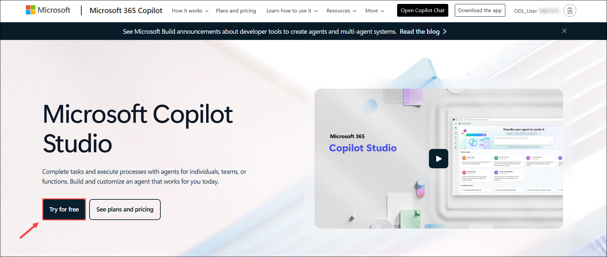

1. On the **Let's get you started** page, enter your azure **Username: <inject key="AzureAdUserEmail"></inject> (1)** and select **Next (2)**. 

    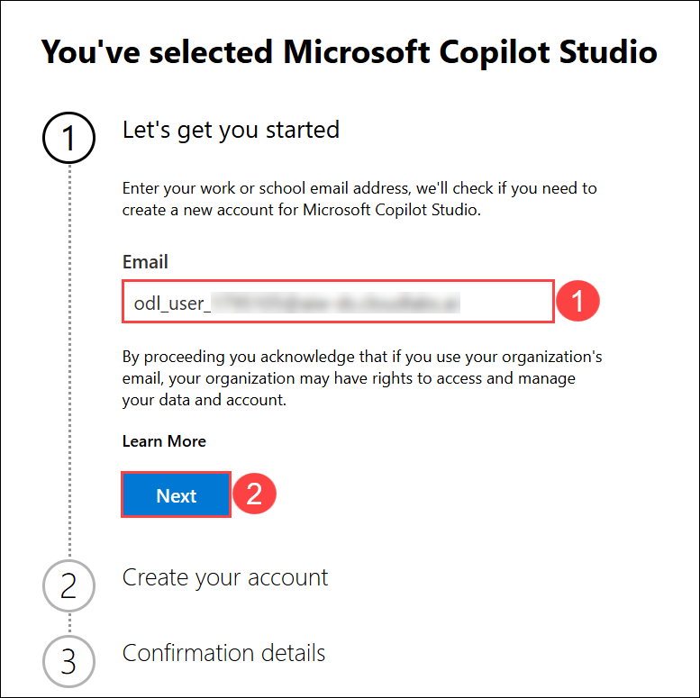

1. To solve the puzzle click **Next**.

    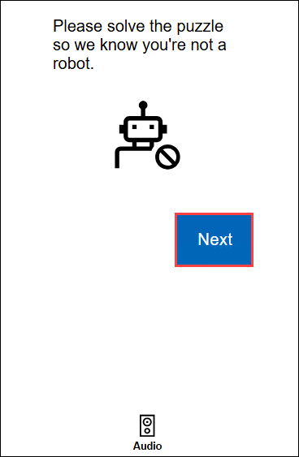

1. Once the puzzle has been solved successfully, click on **Sign in**.  

    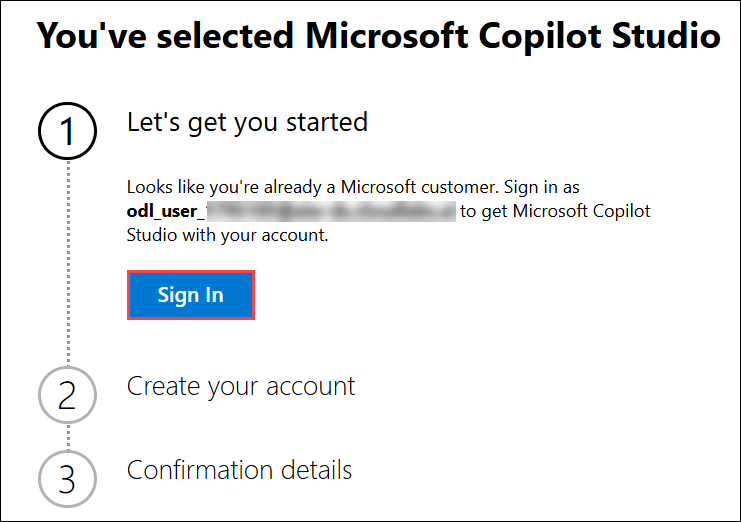

1. Once signed in, under Create your account, select your **respective region (1)** from the drop-down menu. Then, enter your **Job title (2)** and **Phone number (3)**. Finally, click on **Get Started (4)** to proceed.
   
    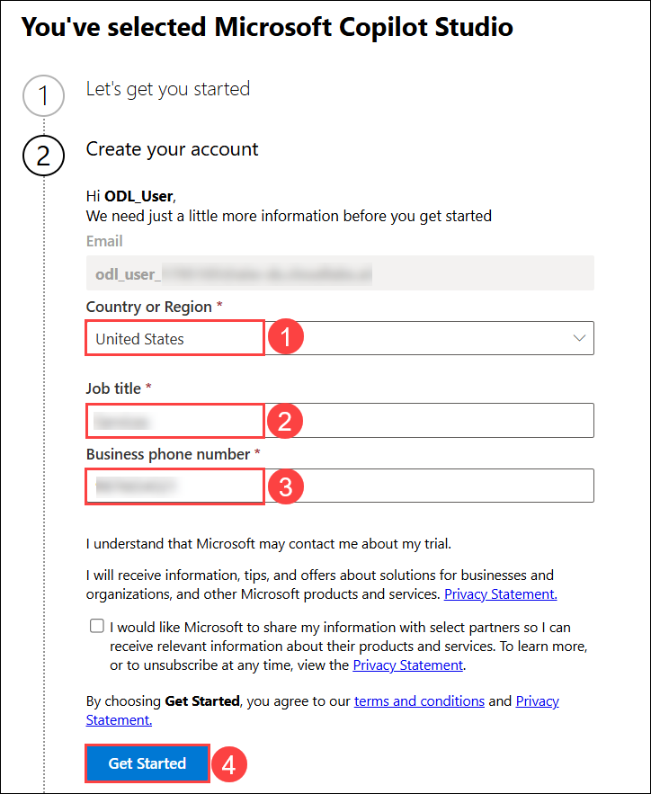   

1. On the Confirmation deatils section, click **Get Started**.

    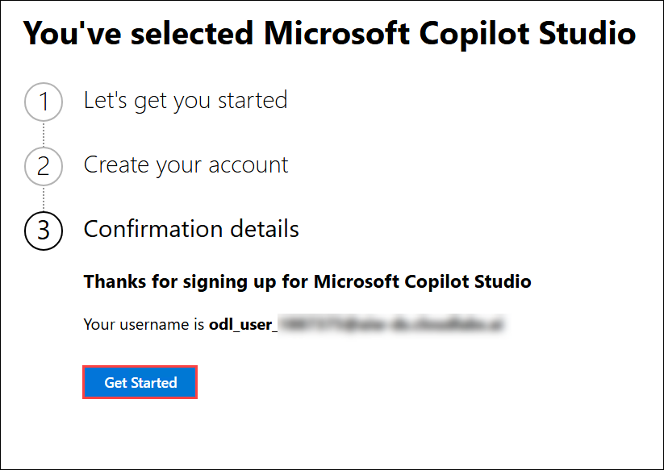

1. You have now successfully signed up for **Microsoft Copilot Studio**.

1. On the **Welcome to Microsoft Copilot Studio (1)** page, choose your respective region and select **Get Started (2)**.

   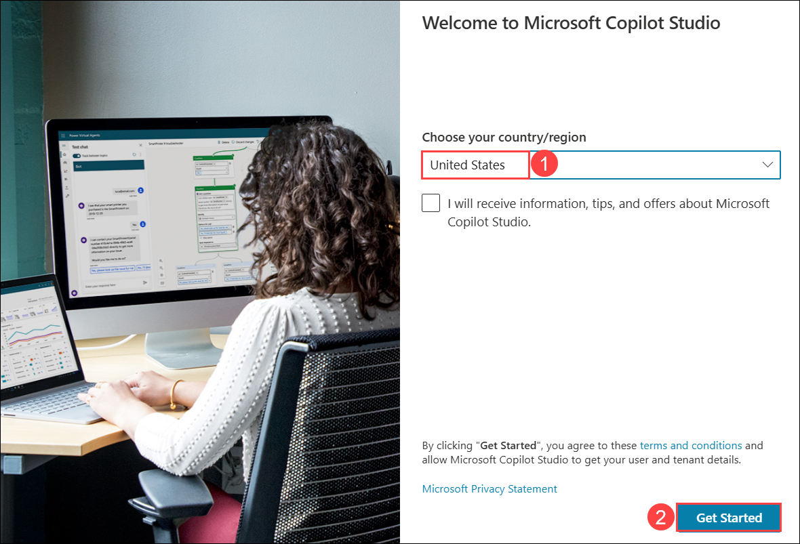
   >**Note:** If you see a page **Welcome to Copilot Studio!**, click on Skip.

1. On the **Start building your agent** page click on **Configure**.

   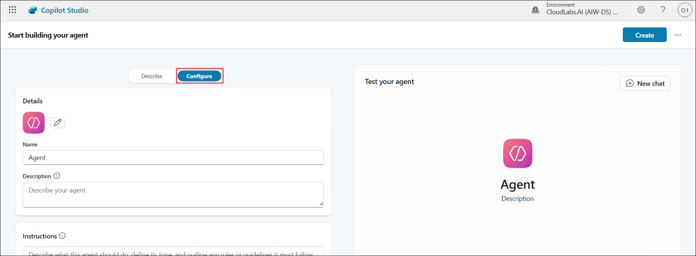

1. On the **Agents** page enter the following details and click on **Create (2)**.

   - **Copilot name (1)**: Enter **AI-Bot-<inject key="DeploymentID" enableCopy="false"/>**

        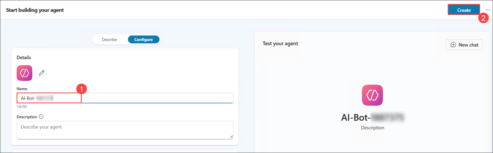

1. Once the Bot is created you will see the Copilot Studio page.

    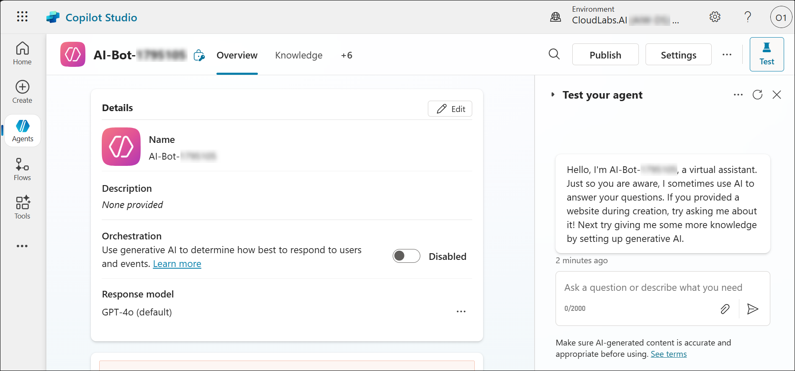

## Task 3: Create a New Topic

In this task, you’ll create a new topic in Microsoft Copilot Studio using the “Add from description with Copilot” feature. You’ll learn how to generate a sample conversation flow, customize it by deleting placeholder nodes, add conditions based on variables (like city), and define branching logic with specific user questions and responses. By the end of this task, you’ll have a fully functional topic that recommends food options based on the user’s selected city and food type.

1. On the **Microsoft Copilot Studio** page, select **Topics** **(1)**, click on **+ Add a topic** **(2)**, and from the drop down menu select **Add from description with Copilot** **(3)**.

    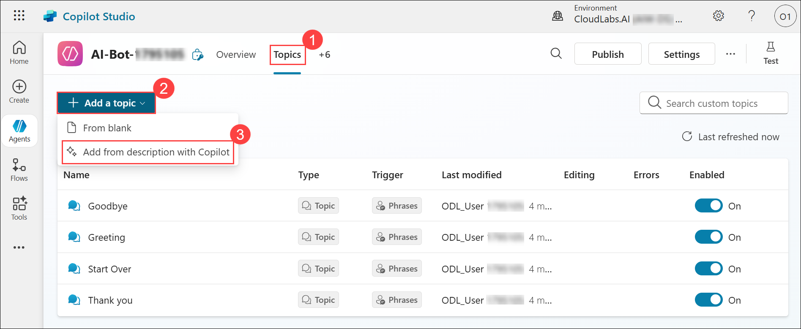

1. In **Add from description with Copilot** pane, name your topic as **Meal in solution** **(1)**. In **Create a topic to ...** section, enter the given phrase "**Checking for food options based on the city you are in**" **(2)**, then click on **Create** **(3)**.

    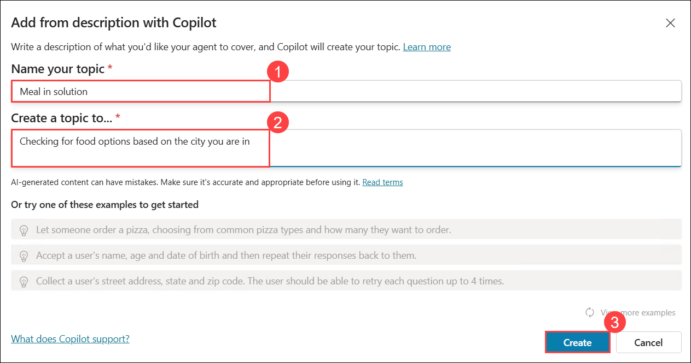

1. Once you are in the topic pane, **close** the **Edit with Copilot** pane on right-side.

    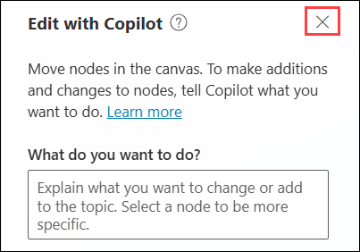

1. When you use **Add from description with Copilot**, the tool generates a sample topic with a suggested conversation flow. This sample may include placeholder questions, entities, or options (like FoodType or City). You can ignore or remove these placeholders and customize the topic by adding your own questions, conditions, and branching logic as needed.

    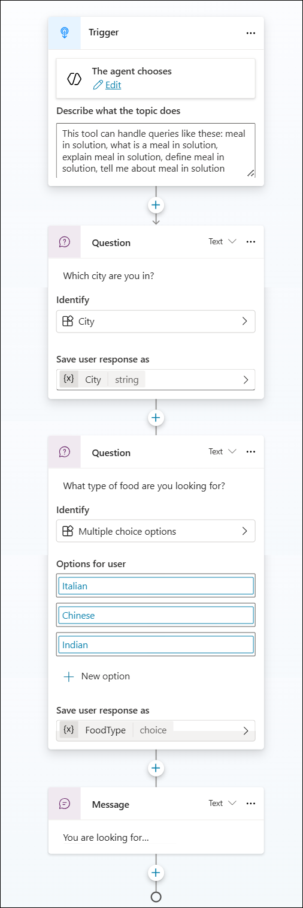

1. In the **Question** (`What type of food are you lookin for?`) node, click on **Ellipsis (...) (1)** and select **Delete (2)**.

    .png)

1. Similarly, click on **Ellipsis (...) (1)** in **Message** node and select **Delete (2)**.

    .png)

1. On the **topics** pane, click on **+ (1)** at the bottom of the **Question** node and select **Add a condition (2)**.

    .png)

1. In add a condition, click on the **variable selector (1)**. From the variable list, select **City (2)**, Choose the condition type **is equal to (3)** and enter **Los Angeles (4)** as the value for the condition.

    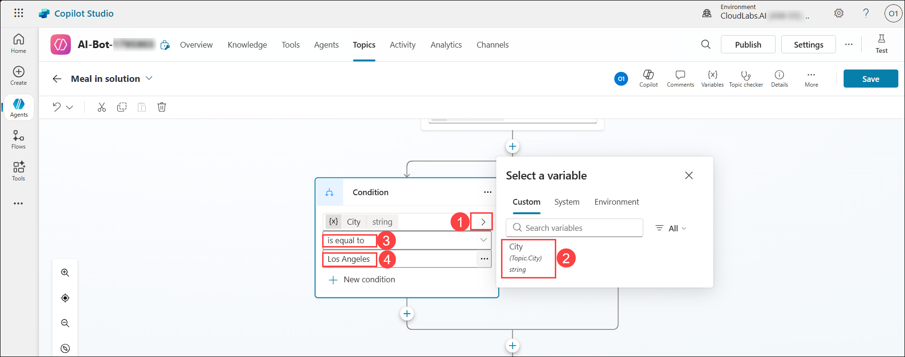

1. Add another condition by clicking on the **+ (1)** at the bottom of the **Question** node and and select **Add a condition (2)**.

    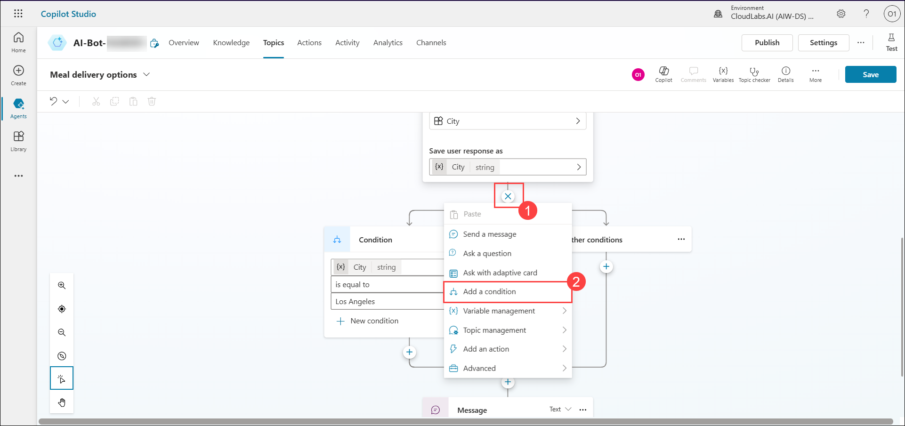

1. In add a condition, click on the **variable selector (1)**. From the variable list, select **City (2)**, Choose the condition type **is equal to (3)** and enter **Seattle (4)** as the value for the condition.

    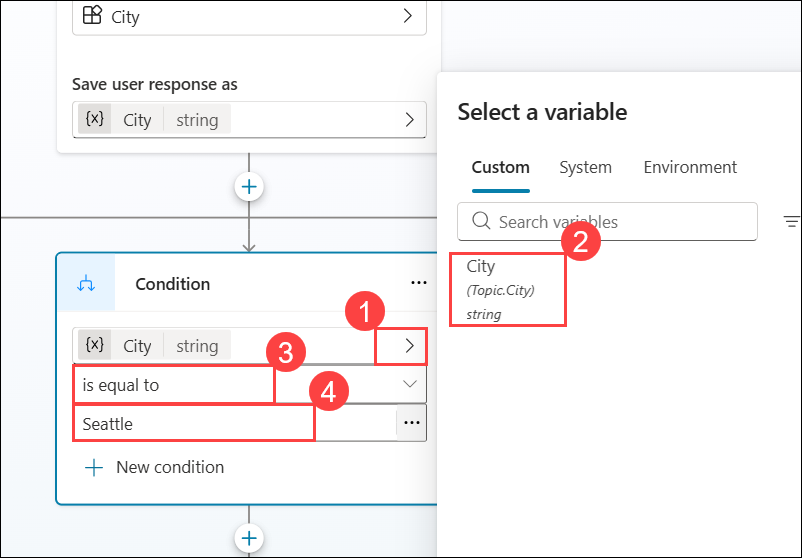

1. Click on **+ (1)** at the bottom of the **Question** node and select **Ask a question (2)** from the drop-down while adding a node.

    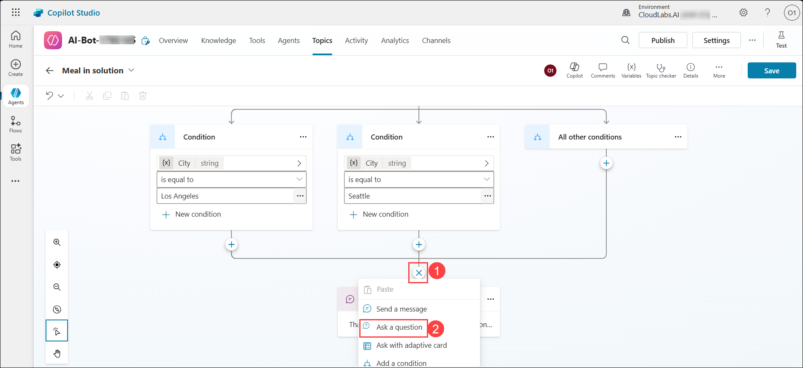

1. Enter the question as "**What type of food would you like to order?**" **(1)** and under options for users, click on **+ New option** **(2)** to add types of food. Add **Chinese (3)** and **Italian (4)**  as shown in the below screenshot.

    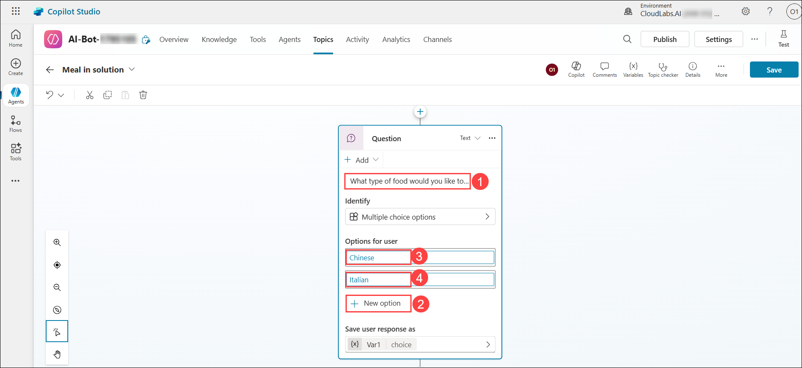
   
1. Now under Condition of **Chinese**, click on **+** to Add node.

    

1. Select **Send a message** from the drop-down while adding a node.

    

1. Enter the Chinese food items given here in the message section: **Noodles, Spring Rolls, Fried Chicken**.

    

1. Now under Condition of **Italian**, click on **+** to Add node.

    

1. Select **Send a message** from the drop-down while adding a node.

    

1. Enter the Italian food items given here in the message section: **Pizza, Pasta, Truffles**.

    

1. Review the topic trigger, and click on **Save** from the right-top corner to save the topic.

    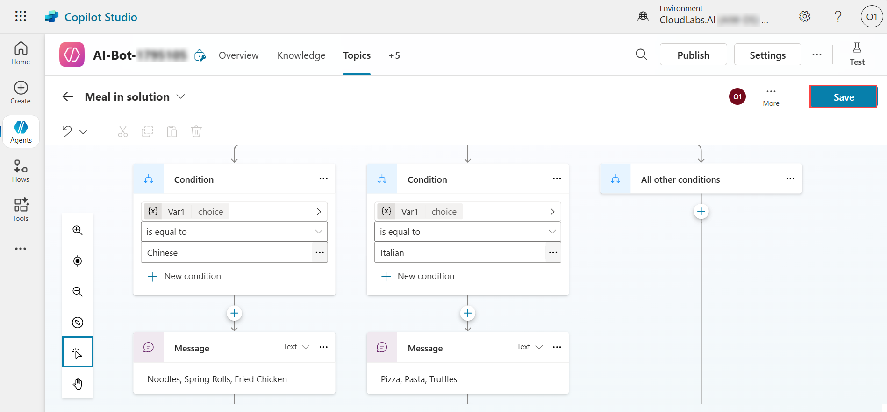

> **Congratulations** on completing the task! Now, it's time to validate it. Here are the steps:
> - Hit the Validate button for the corresponding task.
> - If you receive a success message, you can proceed to the next task. If not, carefully read the error message and retry the step, following the instructions in the lab guide.
> - If you need any assistance, please contact us at cloudlabs-support@spektrasystems.com. We are available 24/7 to help you out.

<validation step="1f3092c6-421b-4e88-8fe6-b5cb70ca1396" />

## Task 4: Test your Copilot

In this task, you’ll test the topic you created in Microsoft Copilot Studio. You’ll learn how to interact with your Copilot by entering sample phrases, providing variable inputs like the city and food type, and verifying that the chatbot responds correctly with the expected meal options. By the end of this task, you’ll confirm that your Copilot topic is functioning as intended.

1. Once the Topic is saved, click on **Test (1)** from the right-top corner.

2. In the **Test your agent** pane, enter the given phrase `what is a meal in solution` **(2)** and then enter the city name as `Seattle` **(3)**, You can select the type of food that you are looking for i.e., **Chinese or Italian (4)**. 

    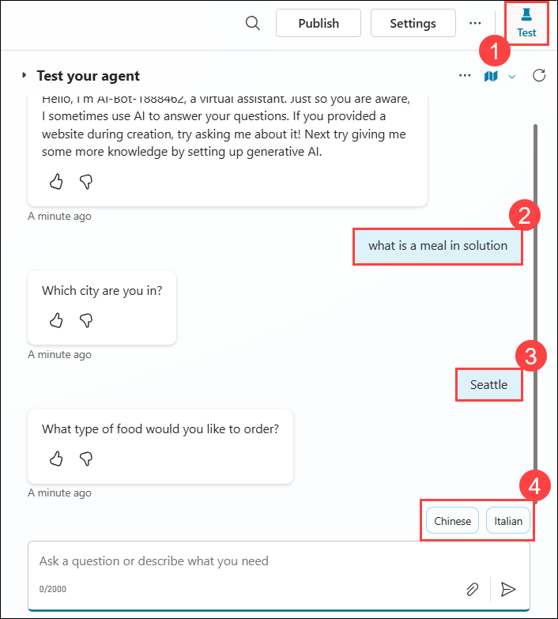

3. Your chatbot should display the names of the meals as shown below.

    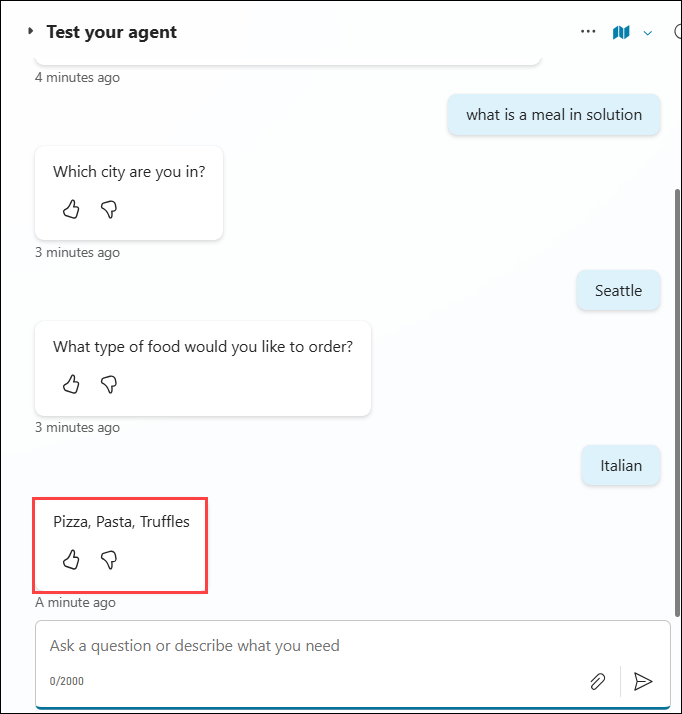

Now you have successfully created and tested the Microsoft Copilot.

## Summary 

In this lab, you set up Microsoft Copilot Studio, created your first Copilot, and tested it by developing and validating a new topic.

### Conclusion

By completing the **Innovate with Ai** Hands-On lab, you have successfully designed and implemented an end-to-end AI solution using Azure's powerful suite of services. You have achieved the classification of COVID-19 research papers through Azure Automated ML, enabling automated and scalable machine learning workflows. You applied Natural Language Processing techniques to extract and summarize key insights from unstructured documents, improving accessibility and comprehension. Through Azure AI Search, you enabled intelligent indexing and semantic search across a large dataset, and finally, you built a no-code Conversational AI interface using Microsoft Copilot Studio, allowing users to interact with the research corpus through natural language.

This hands-on experience has equipped you with practical skills in AI solution development on Azure, demonstrating how multiple AI services can be integrated to solve complex, real-world problems efficiently.

### You have successfully completed this Hands-on Lab!
